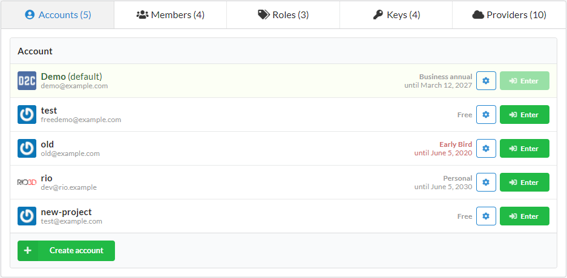
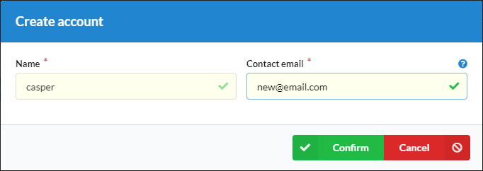

# Introduction

You can create any amount of accounts you need from your current one. It can be helpful, for example, when you want to divide your projects or projects of your customers/clients to different accounts and [Weave networks](/platform/private-network/).

!!! note

    You can't delete your last own account and account with active hosts

## How to create a new account

1. Opan an [accounts](https://panel.d2c.io/account/accounts) page
2. Click **Create account**
3. Specify a name and email. The email will be used for avatar and important notifications

After a new account is created, you can easily log in to any of them without the need to enter login credentials. Moreover, you can set a default account which you would be redirected after a new login.

