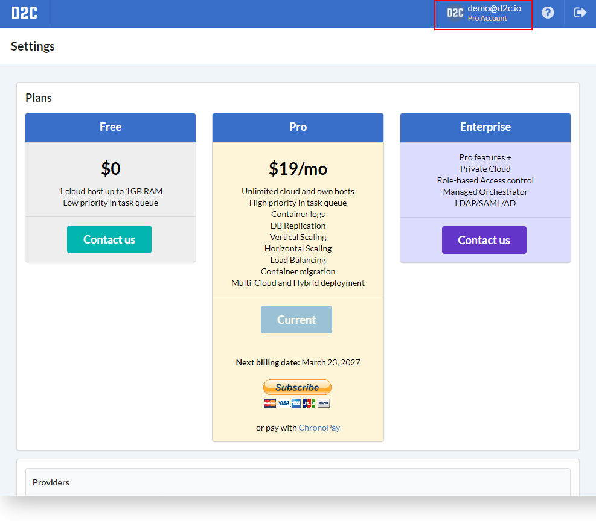
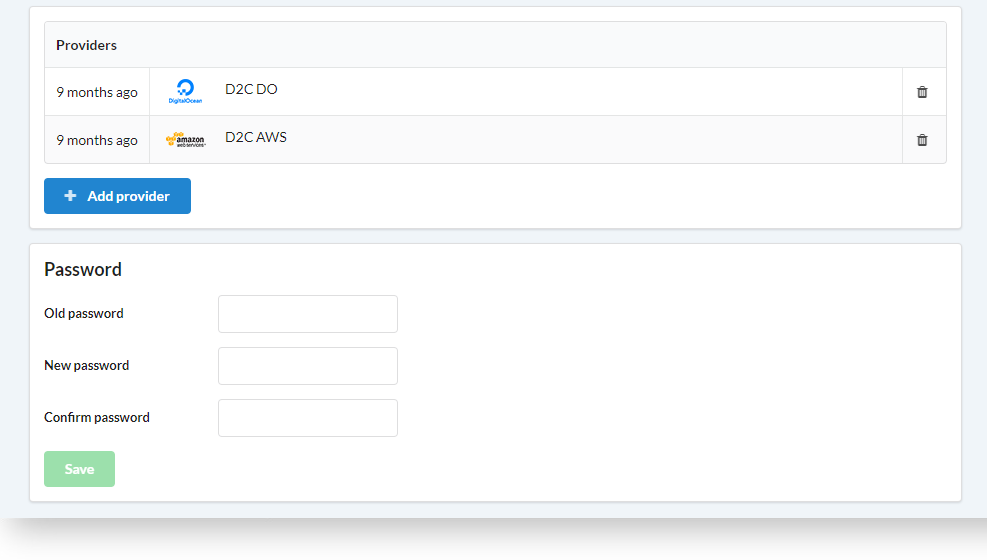

# Introduction

Для того, чтобы создать аккаунт в D2C перейдите по [ссылке](https://panel.d2c.io/account/signup). Вы можете использовать профили социальных сетей (Google, Facebook, GitHub, BitBucket) или логин и пароль.

В настройках аккаунта вы можете:

- изменить пароль
- изменить тариф
- добавить или удалить аккаунты [облачных провайдеров](getting-started/cloud-providers/#_2)

