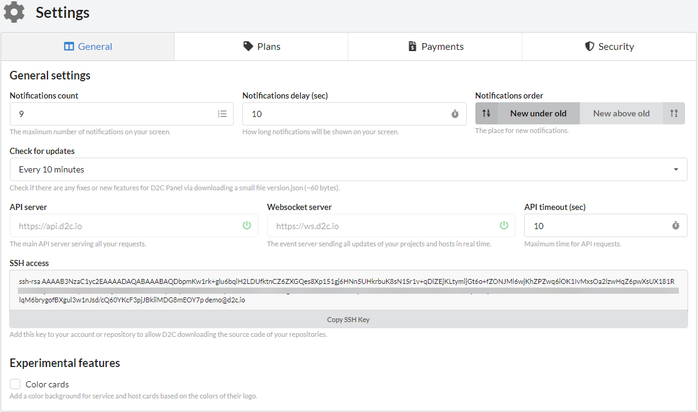
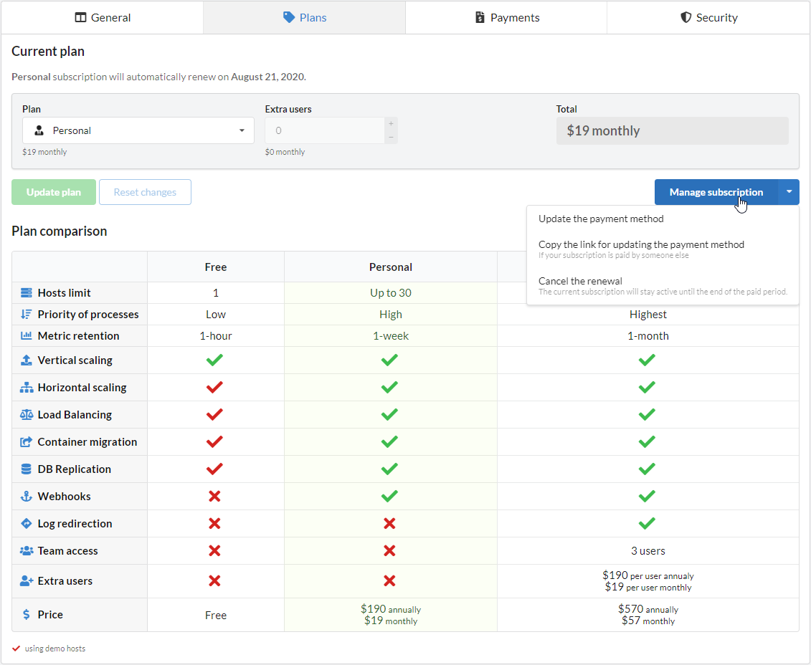
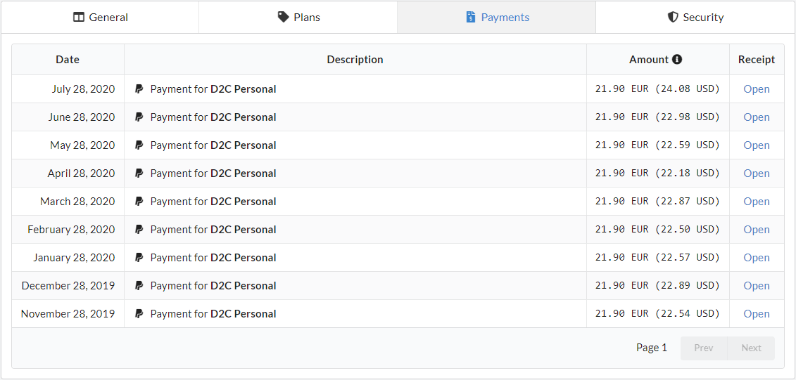
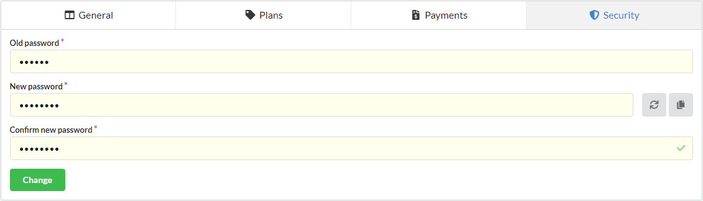

# Introduction

To create D2C account follow this [link](https://panel.d2c.io/user/register). You can use any of social profiles (Google, Facebook, GitHub, BitBucket) or your email and password.

## General settings

In [general settings](https://panel.d2c.io/settings/general), you can:

- Set the parameters of notifications
- Set the time of checking for D2C updates. A small file `version.json` will be downloaded (~60 bytes)
- Check the status and links of API and WebSocket servers
- Copy your D2C open SSH key. You can use it for repositories to allow D2C download sources for your services
- Set and try experimental features

## Plans

In [plans](https://panel.d2c.io/settings/plans) you can:

- Subscribe to plans
- Change a plan
- Manage subscription:
    - Update payment method
    - Copy a link for updating payment method
    - Cancel the renewal

## Payments

In [payments](https://panel.d2c.io/settings/payments) you can check all previous payments and open a receipt.

## Security

In [security](https://panel.d2c.io/settings/security) you can check change a password for an account.

