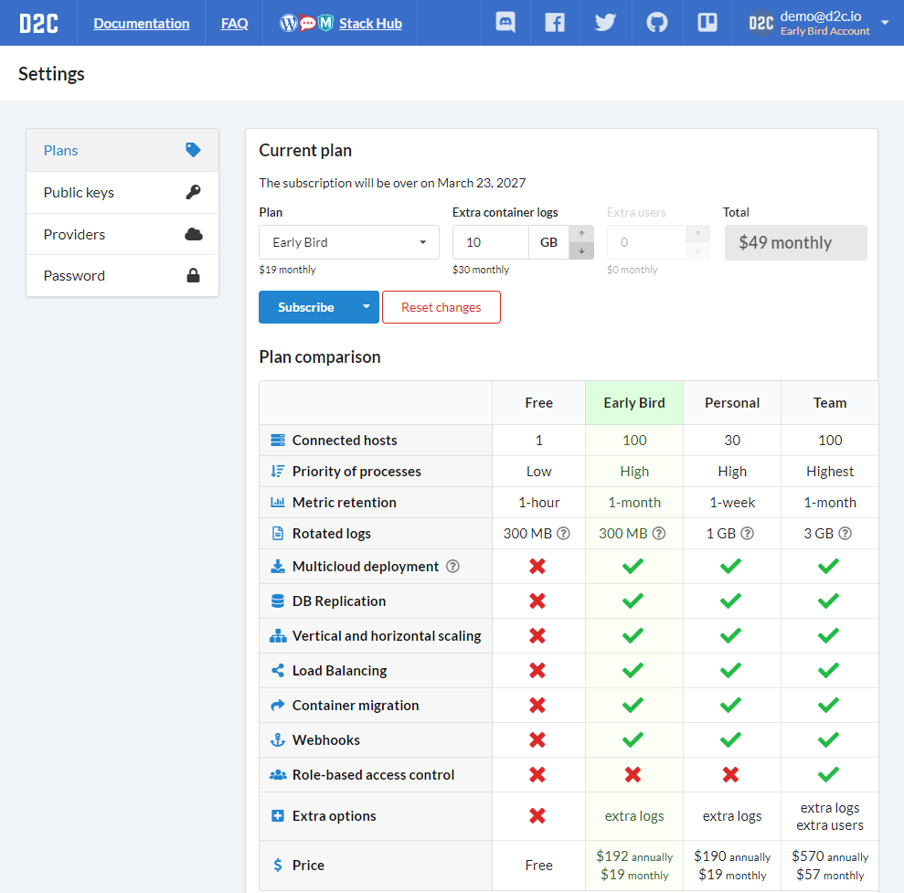
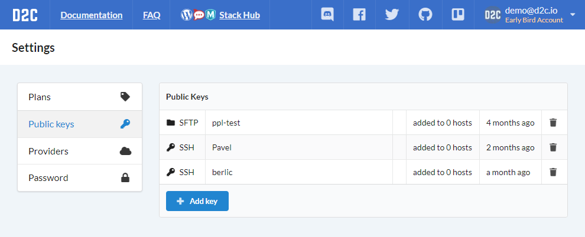

# Introduction

To create D2C account follow this [link](https://panel.d2c.io/account/signup). You can use any of social profiles (Google, Facebook, GitHub, BitBucket) or your email and password.

In [account settings](https://panel.d2c.io/settings) you can:

- upgrade [plan](/account/plan/)
- add or delete [public keys](/platform/ssh-sftp)
- add or delete accounts of [hosting](/getting-started/cloud-providers) and [storage](/getting-started/storage-providers) providers
- change password

### Screenshots

