# Introduction

Team management allows you to invite co-workers to your D2C [accounts](/account/multiple-accounts) and set individual or global access to projects, [hosts](/hosts/hosts/), [services](/services/services/), [providers](/providers/cloud-providers/), [keys](/platform/ssh-sftp/) and account.

It's a feature for [Personal and Business ](/account/plan) accounts.

## Global roles

You can find [Roles page](https://panel.d2c.io/account/roles) clicking on Manage → Roles in the top menu of the dashboard.

Global rules take effect on all of the objects in D2C. If you need individual rules, you need to use [local rules](/account/team-management/#local-rules).

There are no restrictions on the number of roles.

### How to create a new role

1. Click **Add role** at the [Role page](https://panel.d2c.io/account/roles)
2. Give it a name
3. Choose access you want to give or copy from the existing role (you can also find presets: `Admin`, `Dev` and `Guest`)
4. Click **Confirm**

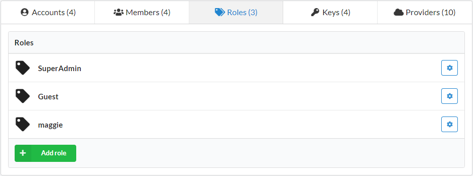

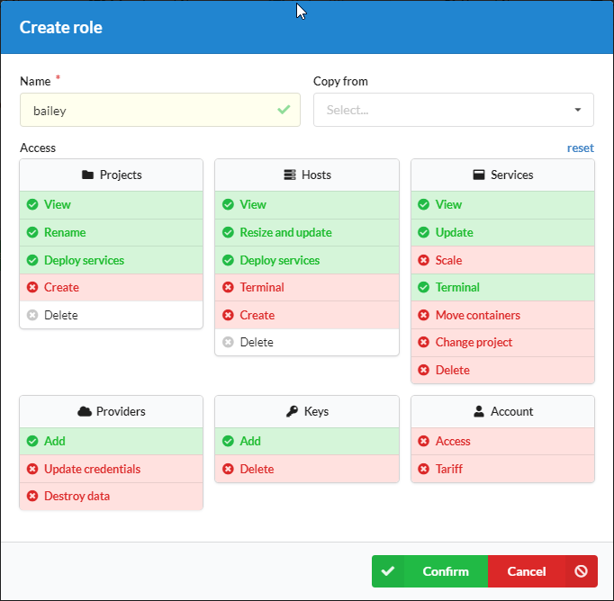

### Edit a role

You can update any role at the list of roles

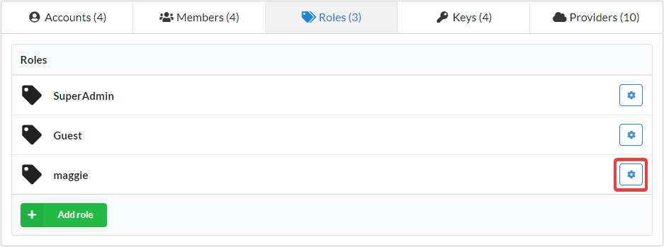

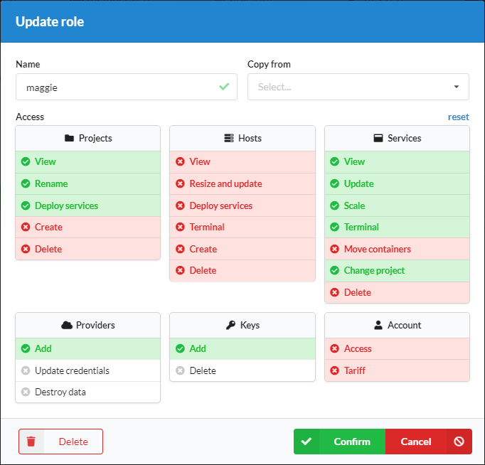

## Members

You can find [Members page](https://panel.d2c.io/account/members) clicking on Manage → Members in the top menu of the dashboard.

### How to invite a new member

1. Click **Invite member** at the [Role page](https://panel.d2c.io/account/members)
2. Specify an email and name
3. You can set a [role](/account/team-management/#roles) at this step. But it's not necessary as you can edit roles and permissions anytime you need
4. Moreover, you can give access only for a period of time at **Access until** field
5. Click **Send invite**
6. An email with a confirmation link will be sent to a new member. It requires to have a D2C account to accept the invite. If this email is not registered in D2C, the new member would be redirected to [Sign up](https://panel.d2c.io/user/register) form.

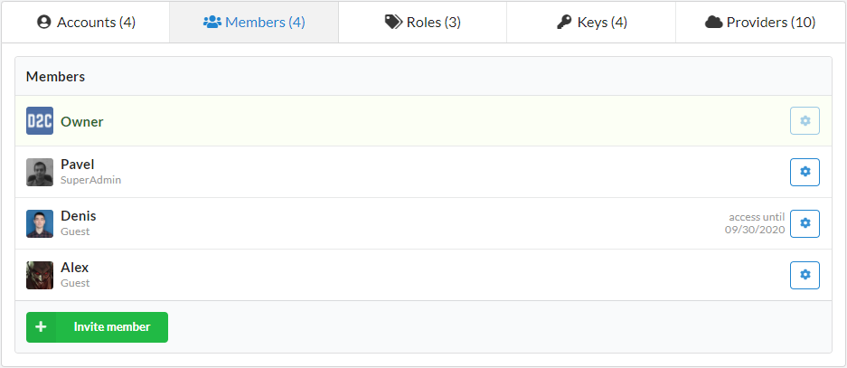

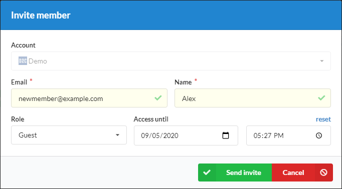

### Edit a member

You can update settings for members using the edit button at the list of members.

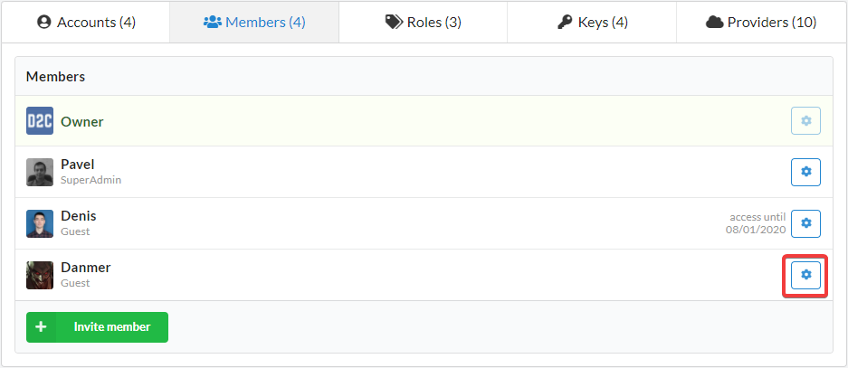

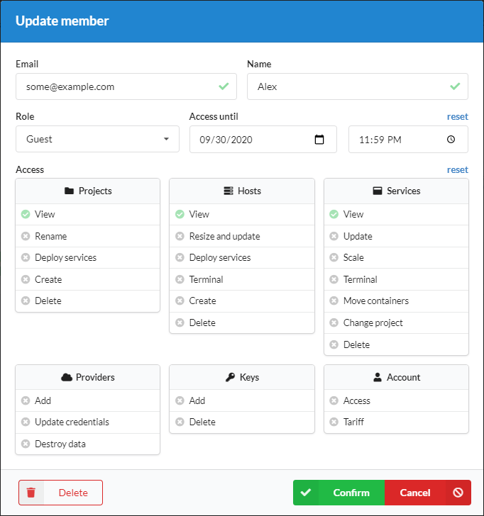

## Local rules

This is a feature for [Business ](/account/plan) accounts only.

You can set individual rules for each member or roles to projects, [services](/services/services/) and [hosts](/hosts/hosts/) in D2C.

When a local rule is set, it has priority over [global roles](/account/team-management/#global-roles).

The lower the position of a rule in the interface, the higher priority an object has. The hierarchy:

- Global role (the lowest priority)
- Global member
- Project role
- Project member
- Local role
- Local member (the highest priority)

### Projects

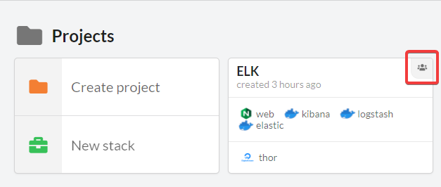

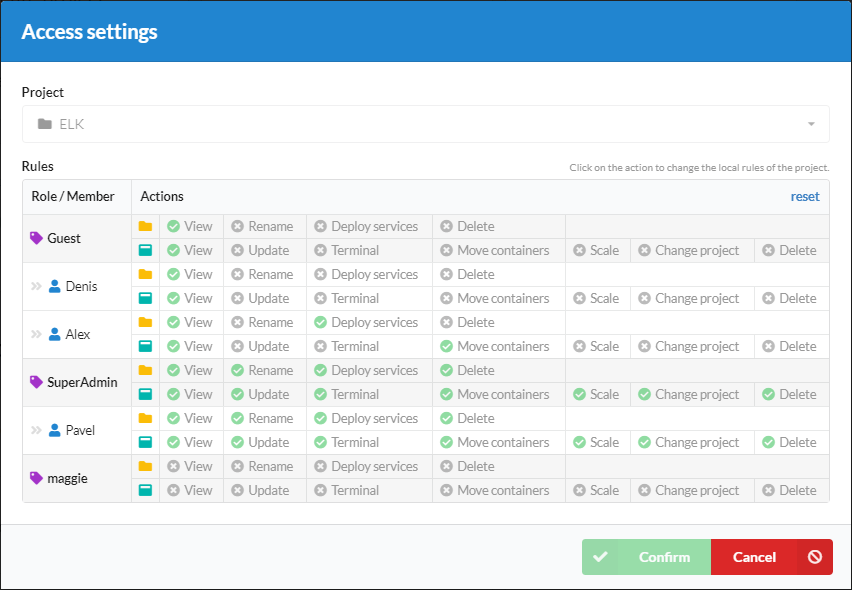

### Services

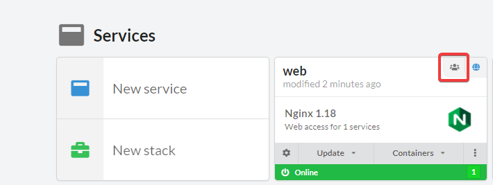

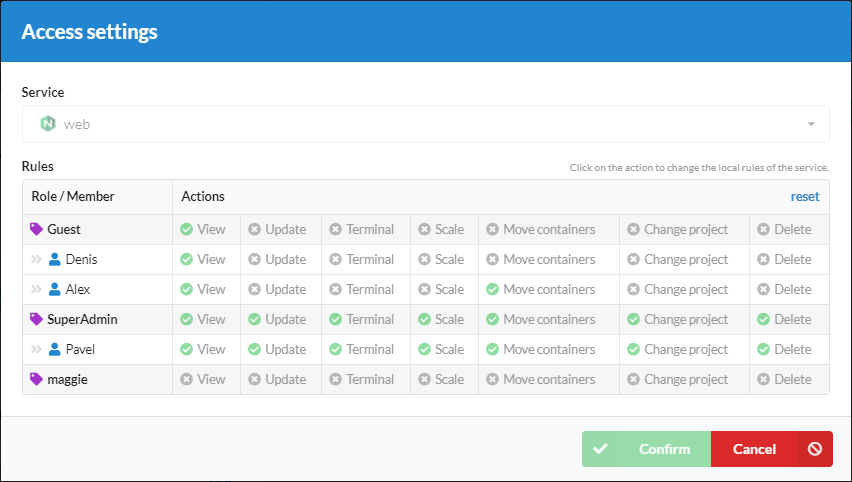

### Hosts

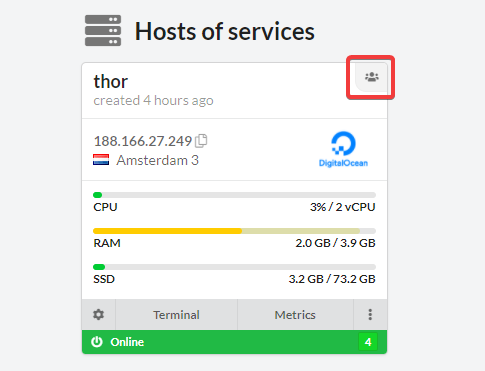

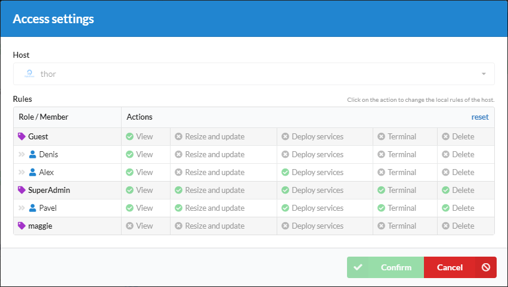
