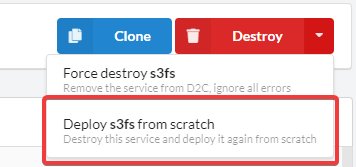

# FAQ

## Security

*Question*: Do you store credit card information?

**Answer**: We do not store any payment information on our servers. It is handled by [Paddle](https://paddle.com/) payment provider.

*Question*: How do you protect my websites/apps?

**Answer**:

- We do not put `git` folder to a website directory
- All containers are run in Weave Private Network. By default, only NGINX and HAProxy have access from the Internet
- There are different settings of TLS certificates

*Question*: Can I use a firewall to avoid access to my hosts?

**Answer**: Yes. D2C connects to user's hosts from 52.58.244.78 and 52.57.161.208 addresses and you can add them to your firewall.

*Question*: Do you store my source code?

**Answer**: No. After we pull your source code and copy it to your hosts we delete the source code from our hosts.

## Weave FAQ

Error:

`Reset weave service... WARNING: the following containers are still attached to network "weave": 89669f417f0a 9db2e7644cee Docker operations involving those containers may pause or fail while Weave is not running Weave is not running.`

Meaning:

It can happen when you update Weave separately or full update of system services on a host. It means that there are two containers in Weave network which weren't stopped automatically. The solution is to stop them manually using the next command in the terminal of a host:

`docker stop 89669f417f0a 9db2e7644cee` (ID are used only for this case. You should copy the ID of your container(s) from the error you get)

## NGINX FAQ

When **Serve static files** is enabled and you get the next error during deploying NGINX:

`Error creating container: 404 Client Error: Not Found ("{"message":"No such container: php-service"}")`

This means that:

- NGINX and a served service placed at different hosts
- A served service is offline or not deployed yet (etc still deploying)

## Initial commands

*Question*: What is an initial command?

**Answer**: Commands which are executed only once on the first container after the first deploying a service. As an example, you can use it for populate database or migration.

*Question*: Why nothing happens when I try to change it?

**Answer**: You can run initial commands again using **Deploy from scratch** button.

## Common issues with hosts

When the system disk is out of space:

`sudo /usr/bin/d2c_system_cleanup.sh`

When the host shows with offline status in D2C:

`sudo supervisorctl restart d2c_ping`
