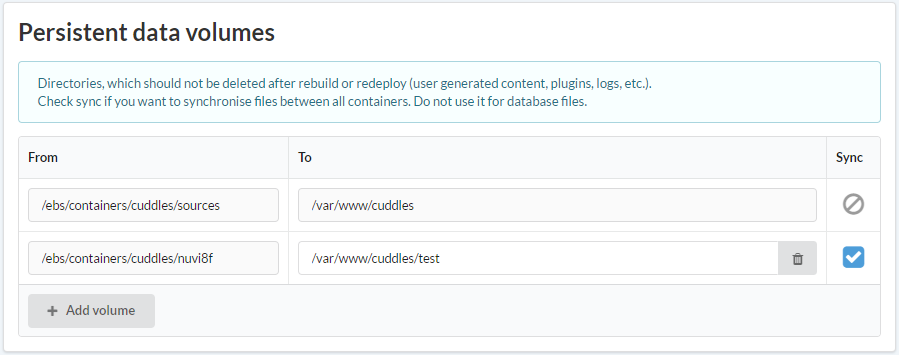
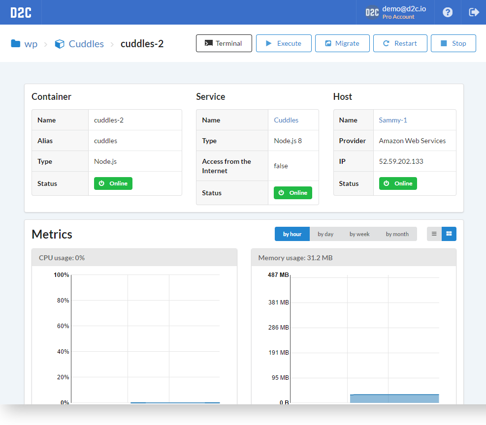

# Introduction

There is a lot of revealing information about Docker containers. Here is a link to an [article](https://www.docker.com/what-container) about it from the Docker website.

## Persistent data

Containerized applications should be lightweight, disposable, and easily replaceable. For this reason, D2C separates the application itself from its data. Docker volumes are used to store persistent data. Data is stored locally on the hosts. If you provision your hosts with D2C at Amazon EC2, it creates a separate EBS partition for containers' data, which can later be enlarged or replaced from your dashboard.

### Synchronizing

We recommend to store _user generated content_ in cloud storage like [Amazon S3](https://aws.amazon.com/s3/) or CDN. Sometimes there is a need to support old technologies when data stores at hosts. For such cases we made a synchronizing volumes between all containers. Simply check the volumes which you want to sync when creating or editing service.

If there is a need to move your service/app to another host, you can do so with our container [migration feature](/platform/migration/) – it will move all your persistent data to the other host as well.

## Actions

- Terminal
- Execute - like [service execution](/getting-started/services/#actions), but with one container
- [Migrate](/platform/migration/)
- Start (stop)

## Logs

<!--нужно больше инфы (спросить у Паши)-->

Each container has logs. You may check them from the interface. [Read more](https://docs.docker.com/engine/admin/logging/view_container_logs/) about Docker logs.

### How the containers page looks like

