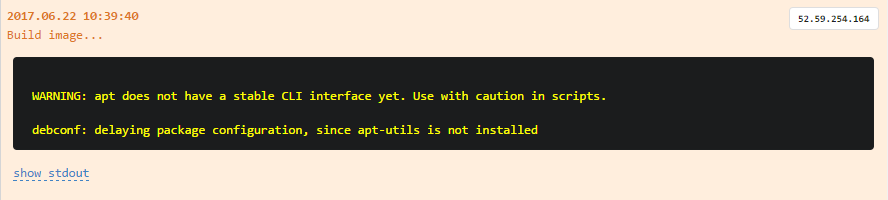
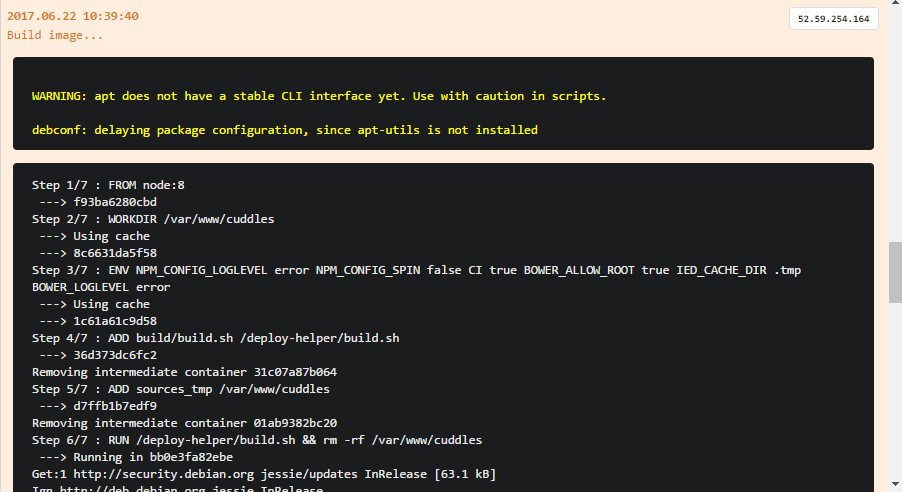
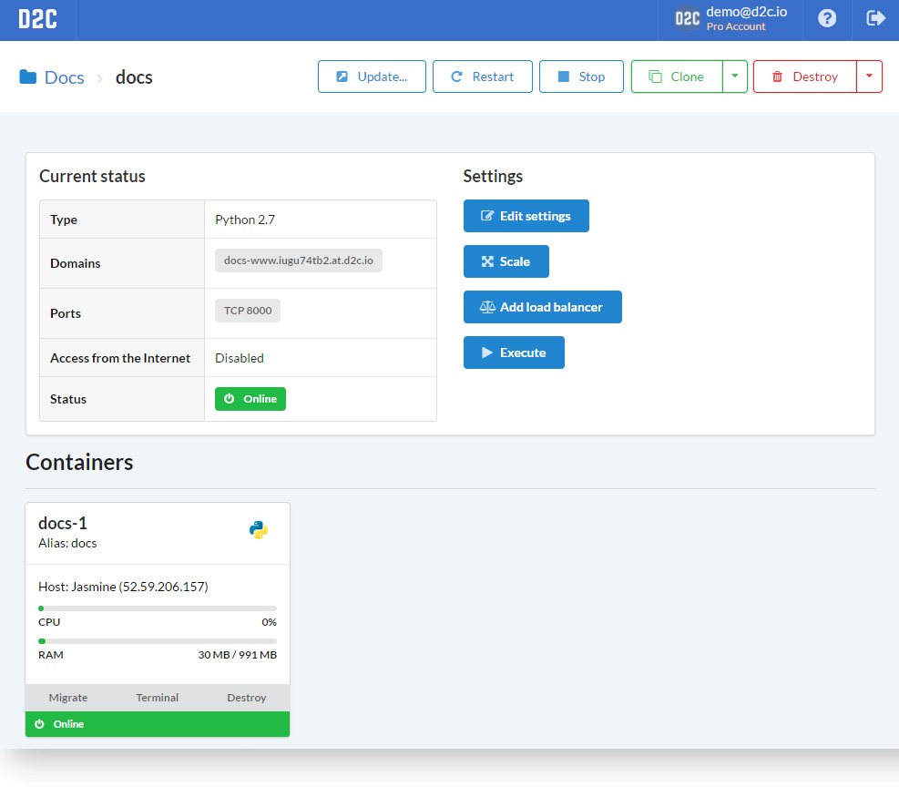
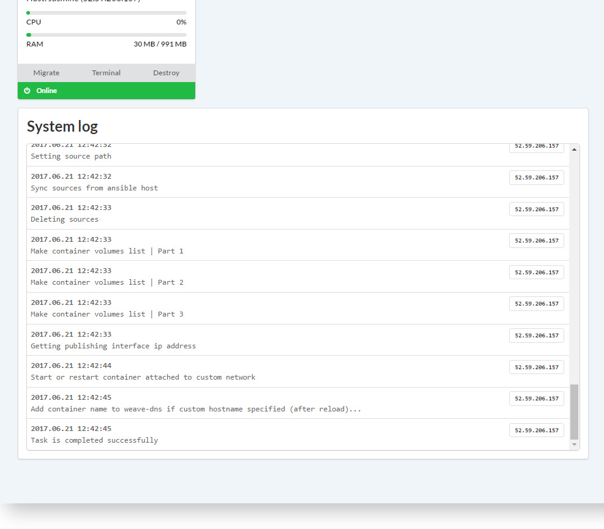

# Вступление

Сервис это приложение, развернутое с помощью D2C.

D2C запускает ваши сервисы/приложения внутри контейнеров. Мы используем Docker в качестве платформы контейнеризации. Каждый сервис это отдельный контейнер: веб-приложение, база данных, балансировщик нагрузки и т.д. Docker устанавливается и настраивается на сервера, которые добавляются в D2C автоматически. Когда вы разворачиваете сервис все необходимые файлы  отправляются на сервер и образ контейнера собирается локально на сервере и затем запускается с помощью демона Docker. D2C настраивает окружение автоматически, поэтому мы не рекомендуем добавлять уже настроенные сервера в целях избежения конфигурационных конфликтов.

Единовременно вы можете развернуть до 50 контейнеров (за исключением сервисов, у которых есть свои ограничения).

## Именование

У каждого сервиса есть своё **уникальное** имя. Сервисы могут обращаться друг к другу по имени сервиса (или по alias-именам, например `servicename-1` или `servicename`). Не важно на каком сервере сервис запущен – все взаимосвязи внутри [приватной сети](/platform/private-network/) прозрачны для сервисов. Более того, мы используем имена для создания публичных доменов, таких как: **_servicename-www.accountID.at.d2c.io_** для ваших сервисов, которые обслуживает NGINX или HAProxy.

Имя должно начинаться с буквы и содержать не более 16 символов (допускаются латинские символы и цифры).

## Нативно поддерживаемые сервисы

### Сервисы хранения данных

| Название          | Конфигурация               | Масштабируемый         | Поддерживаемые версии  |
| :-----------  | :-------------              | :------------- | |
| **MongoDB**       | StandAlone or ReplicaSet    | Да |              2.6, 3.0, 3.2, 3.4 |
| **MySQL**         | StandAlone or MasterSlave   | Да |              5.5, 5.6, 5.7, 8.0 |
| **MariaDB**       | StandAlone or MasterSlave   | Да |              5.5, 10.0, 10.1, 10.2, 10.3 |
| **Percona**       | StandAlone or MasterSlave   | Да |              5.5, 5.6, 5.7 |
| **PostgreSQL**    | StandAlone or MasterSlave   | Да |              9.3, 9.4, 9.5, 9.6 |
| **Crate**         | StandAlone                  | Нет  |              0.57, 1.0 |
| **Redis**         |                             | Да |              2.8, 3.0, 3.2 |
| **Memcached**     |                             | Да |              1.4 |
| **ElasticSearch** | StandAlone                  | Нет  |              1.x, 2.x, 5.x |

### Сервисы приложений

| Название          | Масштабируемый      | Поддерживаемые версии |
| :---------    | :-------------| :-------------      |
| **Node.js**       | Да           | 0.12, 4, 6, 7, 8   |
| **Python**        | Да           | 2.7, 3.3, 3.4, 3.5, 3.6 |
| **Go**            | Да           | 1.6, 1.7, 1.8  |
| **Ruby**          | Да           | 1.9, 2.0, 2.1, 2.2, 2.3, 2.4 |
| **PHP-FPM**       | Да           | 5.6, 7.1 |
| **APACHE+PHP**    | Да           | 5.6, 7.1 |

### Другие сервисы

| Название              | Масштабируемый      | Поддерживаемые версии |  Комментарий
| :-----------      | :-------------| :-------------     | :-------------     |
| **NGINX**                                    | Нет          | 1.9, 1.10, 1.11, 1.12, 1.13 | NGINX is an edge service for serving on top of stack. It can generate free [TSL certificates](/platform/domains-and-certificates/) (by Let's Encrypt).
| **NGINX-Cluster**                            | Да           | 1.9, 1.10, 1.11, 1.12, 1.13 |  NGINX-Cluster for cases when your application does not return static files or you need to serve more than one PHP-FPM container.
| **NGINX-Static**                             | Да           | 1.9, 1.10, 1.11, 1.12, 1.13 | NGINX-Static returns static files (HTML, JS, CSS, images, etc.).  It cannot serve other services.
| **HAProxy**                                  | Нет          | 1.7 |
| **Docker** (Services based on Docker Images) | Да           |     |

## Действия

Действия со всеми сервисами:

- Обновить
- Перезапустить
- Остановить (Запустить)
- [Клонировать](/platform/cloning-apps/)
- Удалить (+удалить с форсом)
- Редактировать настройки
- [Масштабировать](/platform/scaling/) (кроме некоторых сервисов, например NGINX)
- Добавить [балансировщика](/platform/balancing/)
- Выполнить - выполнение команду внутри запущенного контейнера сервиса

У всех [**сервисов приложений**](/getting-started/services/#_5) есть возможность гибкого обновления:

- Обновить версию (у сервисов хранения данных и других сервисов есть только эта функция)
- Обновить глобальные зависимости
- Обновить локальные зависимости
- Обновить исходники
- Включить папку .git

### Взаимодействие с сервисом

## Системные логи

У каждого сервиса есть системные логи (логи деплоя).

Строчки, которые заканчиваются троеточием содержат дополнительную информацию, которую можно открыть с помощью клика мышки.

Сообщения создания образом содержат stdout, которые тоже можно развернуть.

### Как выглядит страница сервиса

