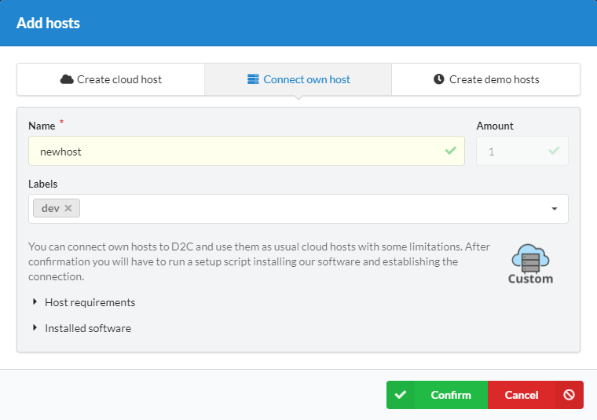
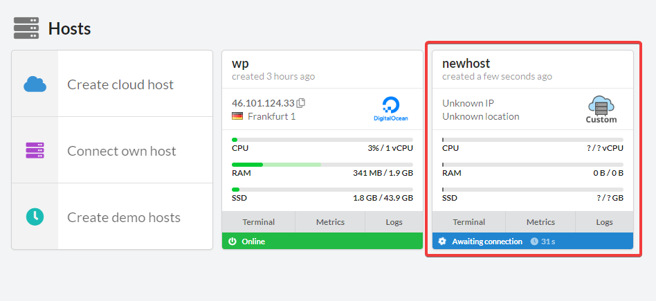
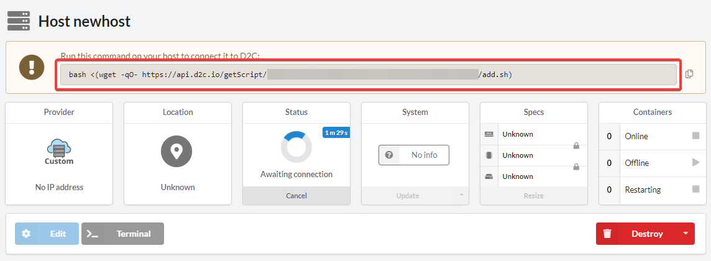

# Introduction

If you want to deploy services on your own in-house servers or at cloud providers that D2C does not currently support, you can do so. We provide a script that checks whether your host complies with the requirements to be added to the D2C dashboard and be a part of your project.

## Supported operation systems and requirements

- RAM: 0.5GB miminum, 1GB or higher recommended
- Ubuntu 16.04/18.04 or Debian 8/9.
- Kernel version >= 4.2. We do not recommend 4.12 and 4.13 because of their poor performance in VXLAN tunneling: 60x decrease
- Free disk space: 5 Gb minimum
- Opened incoming SSH port
- For the Weave network to work, you must open ports 6783, 6784 (TCP/UDP)
- hostname should be unique and cannot be named as "localhost"
- For better performance, we recommend ensuring that VXLAN tunneling is allowed

!!! note

    D2C does not support hosts with installed Docker to prevent any configuration conflicts.

## How to connect own host

<!-- ### Video tutorial

<iframe width="640" height="360" src="https://www.youtube.com/embed/CfX8kkZny2Y" frameborder="0" allow="autoplay; encrypted-media" allowfullscreen></iframe>
  -->

### Step by step tutorial

1. Sign in into your [D2C account](https://panel.d2c.io/user/login).
2. Click **Connect own host**
3. Give it a name (you can also add labels but it's not necessary)

4. Open the host page and copy the command

5. Connect to your host via **SSH**
6. Run the command you copied before and follow the instructions in the terminal
