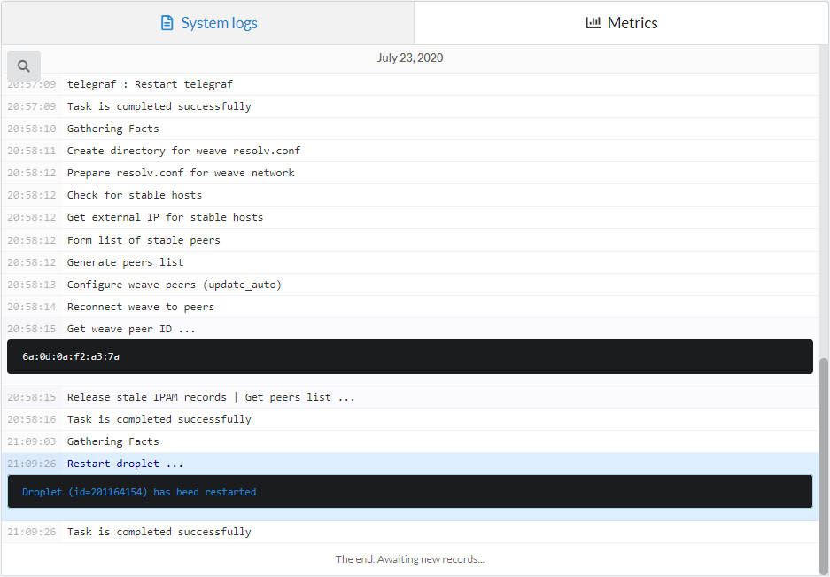
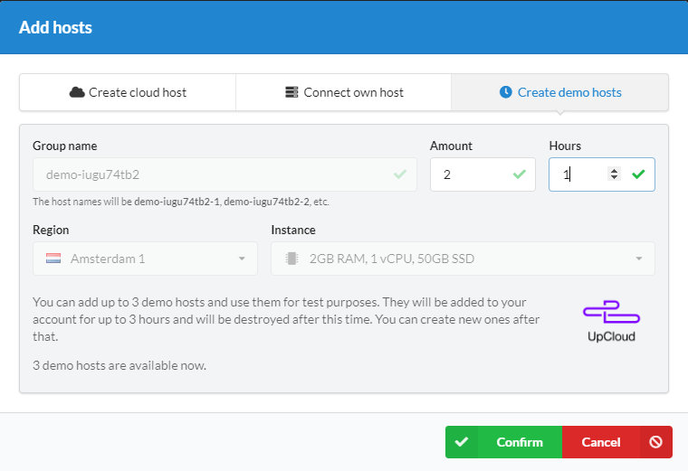
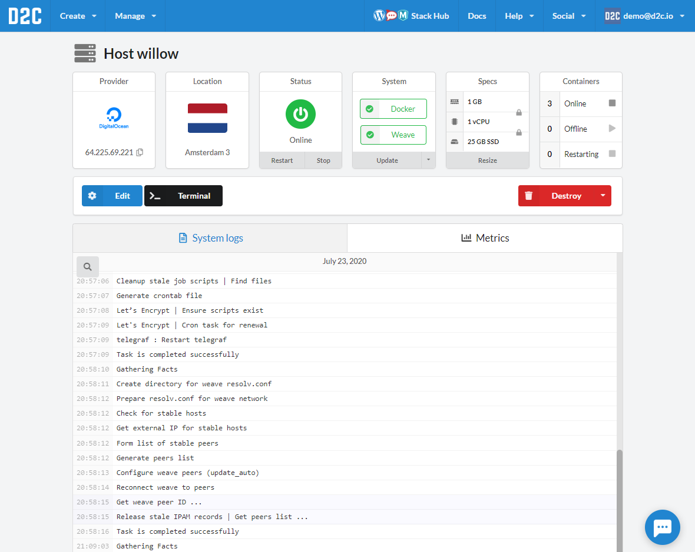
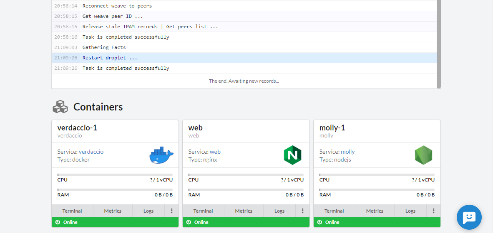

# Introduction

Services can not run without a server on the Internet. D2C can automatically provide servers for you. Just provide an access token for your preferred cloud provider, and D2C will create/destroy/resize servers as you need them. Keep in mind that the cloud provider will charge you for resource usage based on your payment plan. D2C does not provide its own computing resources – it automates the provisioning process at cloud providers.

Each host can be used for any [project](/getting-started/projects/) multiple times.

## Supported hosting providers and OS

When you create a host, we install **Ubuntu 18.04** on it.

### Providers with native support

- [**Amazon Web Services**](/getting-started/cloud-providers/#amazon-web-services)
- [**DigitalOcean**](/getting-started/cloud-providers/#digitalocean)
- [**Google Cloud Platform**](/getting-started/cloud-providers/#google-cloud-platform)
- [**UpCloud**](/getting-started/cloud-providers/#upcloud)
- [**Vultr**](/getting-started/cloud-providers/#vultr)

### In-house hosts

You can [connect your own host](/getting-started/connect-own-host) with Ubuntu 16.04/18.04 or Debian 8/9.

## What software will be installed on hosts?

- Docker
- Weave Network
- Telegraf
- D2C HealthCheck Daemon

## Actions

- Edit
    - Resize CPU, RAM and disk
    - Volume resize (for cloud hosts)
    - Add [public keys](/platform/ssh-sftp/)
- Terminal
- Restart
- Stop/Start
- Update system services (Docker, Weave, Telegraf, Lsync).
- Destroy (+force destroy)
- [Instance Resize](/platform/scaling/#vertical-scaling) (only for cloud hosts)

## Services data

All data of services are stored in:
`/ebs/containers/serviceName`

For example, you can find sources in:
`/ebs/containers/serviceName/sources`

Backups:
`/ebs/containers/serviceName/backup`

## Connecting via SSH and SFTP

[Check the special article about SSH and SFTP access](/platform/ssh-sftp/).

!!! note

    One public key should be used only once regardless of its type (SSH or SFTP). If you need to change a method of connection, you need to create another public key or replace the old one.

## Resizing hosts

### Resize CPU, RAM, Disk

You can resize your instances (CPU, RAM, Disk) in two ways:

- Resizing CPU and RAM, but *not* disk size. It can be reversed. That means that you can increase and decrease an instance.
- Resizing CPU and RAM *and* the disk size. This is a permanent change and cannot be reversed. That means that you'll be able only to increase an instance.

To make a resize click **Edit** or **Resize** at a host page.

### Resize volumes (storage)

#### AWS EBS

Amazon EC2 provides additional storage for instances which calls [Amazon Elastic Block Storage](https://aws.amazon.com/ebs/?nc1=h_ls) (EBS). You can add additional EBS without stops of hosts using D2C interface.

#### GCP Zonal Persistent SSD disks

Google Compute Engine provides additional storage for instances which calls [Zonal Persistent SSD disks](https://cloud.google.com/compute/docs/disks/#pdspecs). You can add additional storage for your hosts using D2C interface.

#### DigitalOcean Block Storage

DigitalOcean provides additional storage for droplets which calls [Block Storage volumes](https://www.digitalocean.com/docs/volumes/). You can add additional storage for your hosts using D2C interface.

## Logs

Each host has logs (server logs).

The line which has ellipsis marks, in the end, can be opened with a mouse click.

## Demo hosts

You can create demo hosts for testing the platform.
The configuration of demo hosts is (2GB RAM, 1vCPU, 50GB SSD).
N. Amsterdam, Netherlands

Demo host creates for three hours and will be destroyed (with all services and containers) after this time expired. You can create another ones after that.

You can find a **+ Free demo host** on the dashboard.

### How the host page looks like

