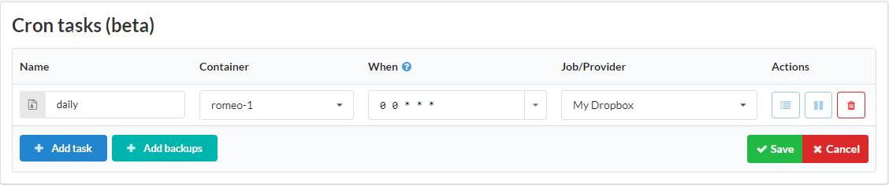
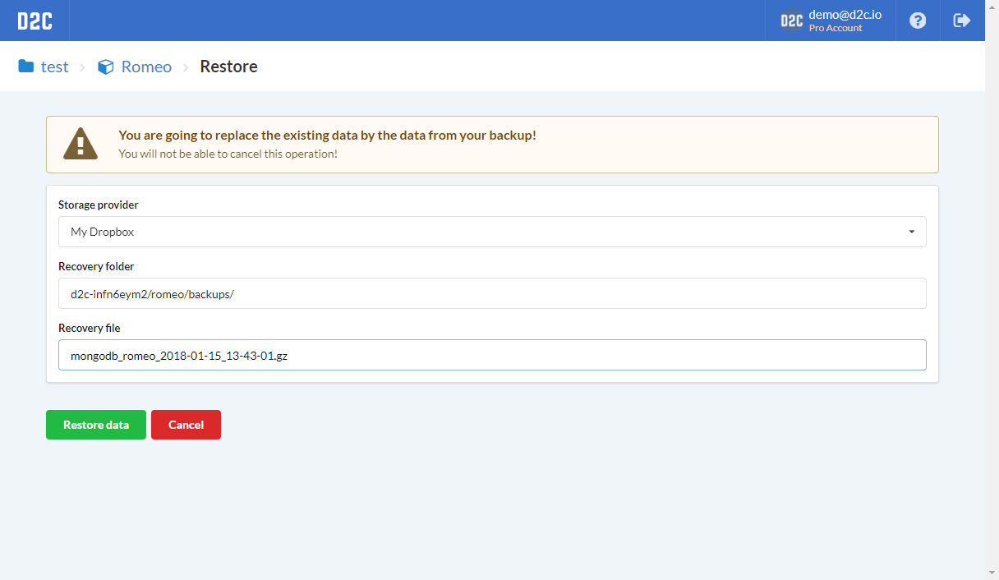
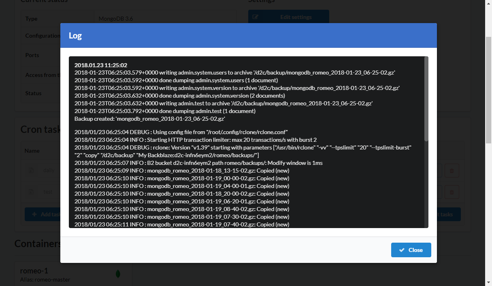

# Introduction

Backup is a process of copying and archiving data so it may be used to restore the original after a data loss event. You can create and manage it at Cron tasks block at the service page.

## Supported services

1. MySQL
2. Percona
3. MariaDB
4. PostgreSQL
5. MongoDB

## Storage providers

1. Amazon S3
2. Backblaze
3. Dropbox
4. Digital Ocean Spaces
5. Microsoft OneDrive
6. Hubic
7. FTP
8. SFTP

## How to create a backup

1. Open a service page
2. Click **+Add backup** at Cron tasks block
3. Enter a name for a new task
4. Choose a container
5. Specify time using time of a host (UTC in most of the times)
6. Choose a storage provider ([How to add a storage provider](/getting-started/storage-providers/))
7. Click **Save**

## How to restore from a backup

!!! note

    We do not guarantee correct restoring from backups made with third party software

1. Open a service page
2. Click **Restore**
3. Choose a storage provider
4. Ensure that the path to the backup is correct. Edit it if necessary
5. Paste the name of the recovery file you want to restore from
6. Click **Restore data**

## Logs

Each backup task logged and you can check it by clicking on **Log** icon.

### Screenshots

