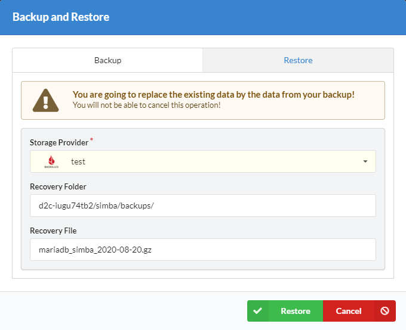

# Introduction

Backup is a process of copying and archiving data so it may be used to restore the original after a data loss event. You can create and manage it at Cron tasks block at the service page.

## Backups

### Supported services

- [MySQL](/services/data-services/mysql-mariadb-percona/)
- [Percona](/services/data-services/mysql-mariadb-percona/)
- [MariaDB](/services/data-services/mysql-mariadb-percona/)
- [PostgreSQL](/services/data-services/postgresql/)
- [MongoDB](/services/data-services/mongodb/)

### Storage providers

- [**Amazon S3**](/getting-started/storage-providers/#amazon-s3)
- [**Backblaze**](/getting-started/storage-providers/#backblaze)
- [**Dropbox**](/getting-started/storage-providers/#dropbox-onedrive-hubic)
- [**DigitalOcean Spaces**](/getting-started/storage-providers/#digitalocean-spaces)
- [**Microsoft OneDrive**](/getting-started/storage-providers/#dropbox-onedrive-hubic)
- [**Hubic**](/getting-started/storage-providers/#dropbox-onedrive-hubic)
- [**FTP/SFTP**](/getting-started/storage-providers/#ftpsftp)

### How to create a single backup

1. Open a service page
2. Click on a **Database backups** tab
3. Choose a storage provider ([How to add a storage provider](/getting-started/storage-providers/))
4. Click **Create backup**

### How to create backups by schedule

1. Open a service page
2. Click **+Add backup** at Cron tasks block
3. Enter a name for a new task
4. Choose a container
5. Specify time using time of a host (UTC in most of the times)
6. Choose a storage provider ([How to add a storage provider](/getting-started/storage-providers/))
7. Click **Save**

### Backup logs

Each backup task logged and you can check it by clicking on **Show task log** button.

### How to clean up old backups from a host

The easiest way is to add the next [cron task](/platform/cron/): 

`ls -td /d2c/backup/* | tail -n +2 | xargs rm -- && echo "OK" || echo "FAIL"`

It removes all backups except the last one.

## Restore

### How to restore from a backup

!!! note

    We do not guarantee correct restoring from backups made with third party software

1. Open a service page
2. Click **Restore**
3. Choose a storage provider
4. Ensure that the path to the backup is correct. Edit it if necessary
5. Paste the name of the recovery file you want to restore from
6. Click **Restore data**

