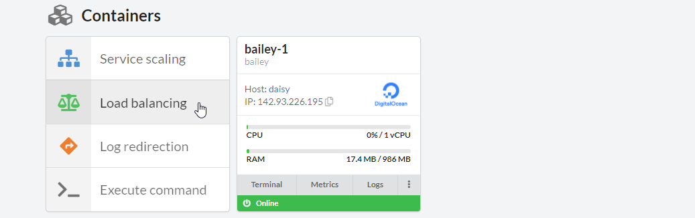

# Introduction

D2C supports load balancing provided by [HAProxy](http://www.haproxy.org/). It works in different modes: **HTTP**, **HTTPS**, **TCP**. The config generates automatically. You can edit it after deploying.

You might find helpful our previous articles about configuring HAProxy ([Part one](https://d2c.io/post/haproxy-load-balancer-part-1-basic-terms-levels) and [Part Two](https://d2c.io/post/haproxy-load-balancer-part-2-backend-section-algorithms)).

## How to deploy a load balancer

Check the [special article](/services/other-services/haproxy/) about deploying HAProxy from scratch.

You can also at first choose a service you need to balance. Follow the next steps:

1. Open a service you want to balance
2. Click **Load balancing** at the containers block. The creating HAProxy page opens with an added [service config](/services/other-services/haproxy/#configure-services) with default HTTP mode and D2C domain.
3. Make any changes if necessary (domains, HTTPS, etc.)
4. Choose a host for an HAProxy and click **Confirm**

