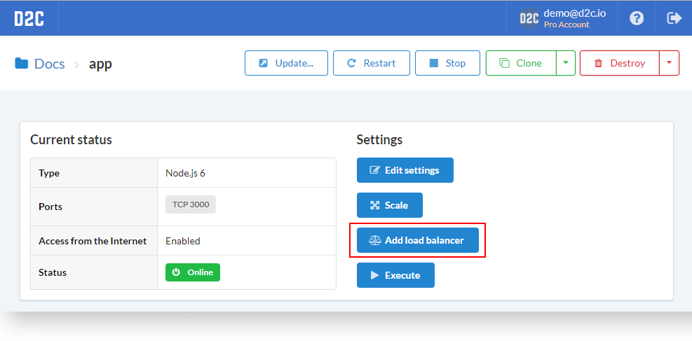
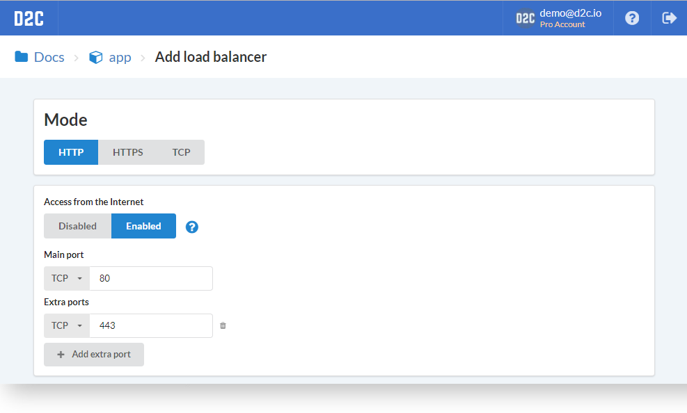
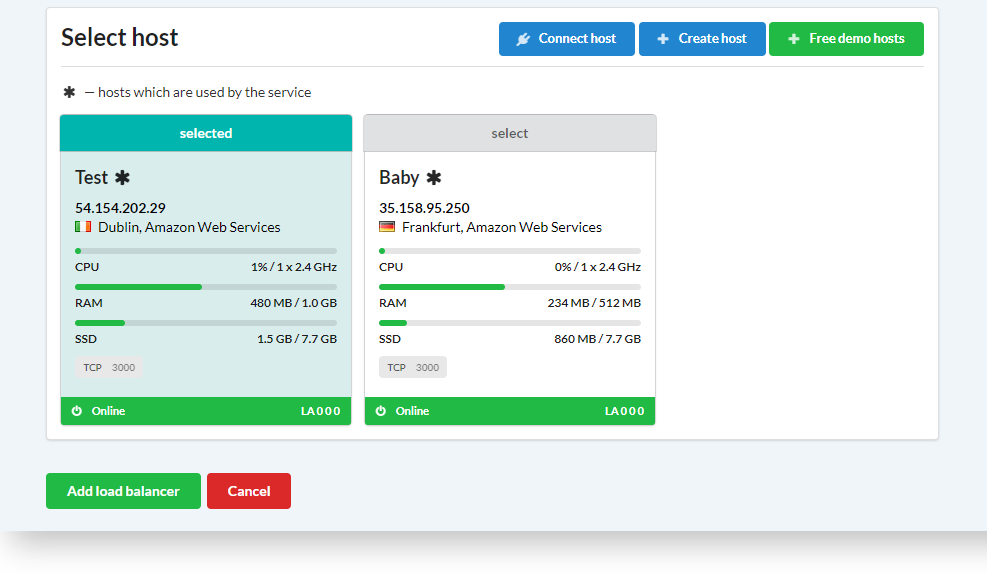
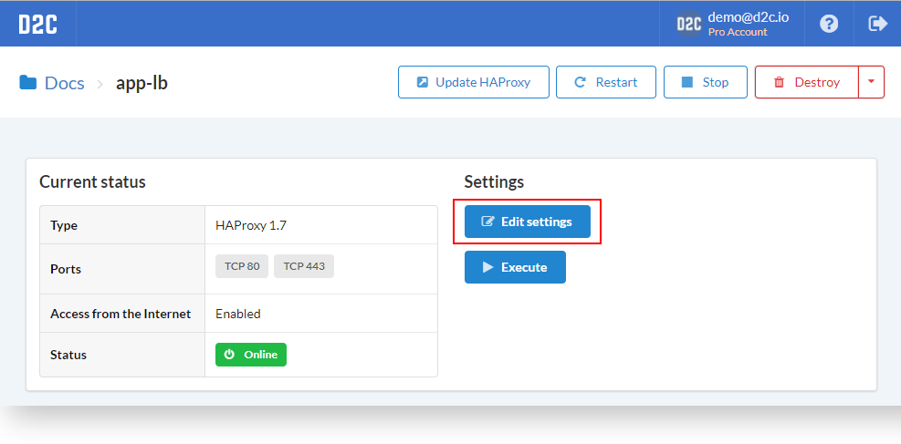
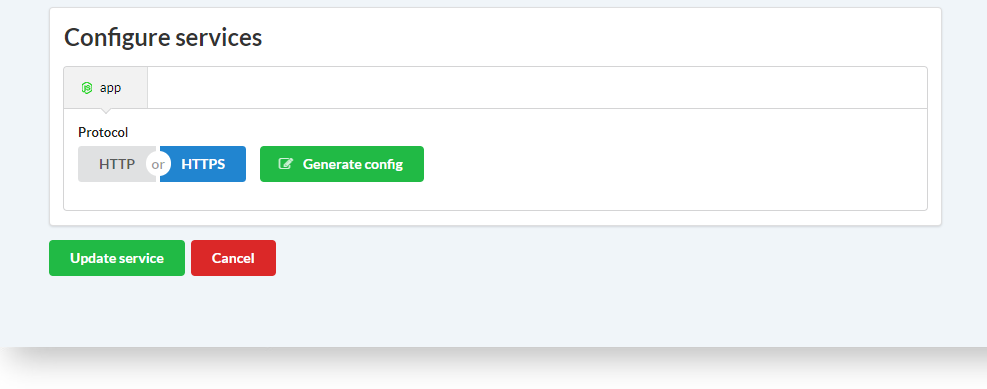
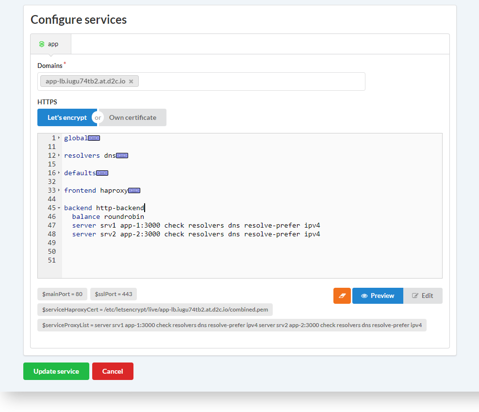

# Introduction

D2C supports load balancing provided by [HAProxy](http://www.haproxy.org/). It works in different modes: **HTTP**, **HTTPS**, **TCP**. The config generates automatically. You can edit it after deploying.

## How to deploy a load balancer

1. Deploy or open a service you want to balance
2. Click **Add load balancer**
3. Choose a mode and a host
4. Click **Add load balancer**

If you use HTTPS HAProxy will be deployed with [Let's Encrypt](https://letsencrypt.org/) certificate (you can also add own certificate [after deploying](/platform/balancing/#edit-load-balancer)). Specify any additional ports if it needs. You can also disable access from the Internet (it is enabled by default).

## Edit load balancer

You can change settings of load balancer after deploying. For this purpose open an HAProxy service, click **Edit settings**.

To change mode or set your own certificate find a **Configure services** block and click on **Generate new config** icon.

Choose a mode and click **Generate new config**.

If you need HTTPS, you cad add an own certificate or use free automatically updated certificates provided by [Let's Encrypt](https://letsencrypt.org/).

Click **Update service**.

