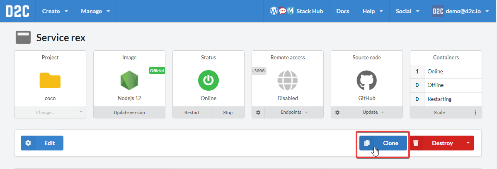

# Introduction

Cloning is a simple way to create service same as original one.

## How to clone

1. Open a service page
2. Click **Clone**
3. Check the settings (they are already copied from the original). You can change any of them here. The process is the same as when you create [services](/services/services/) from scratch.

