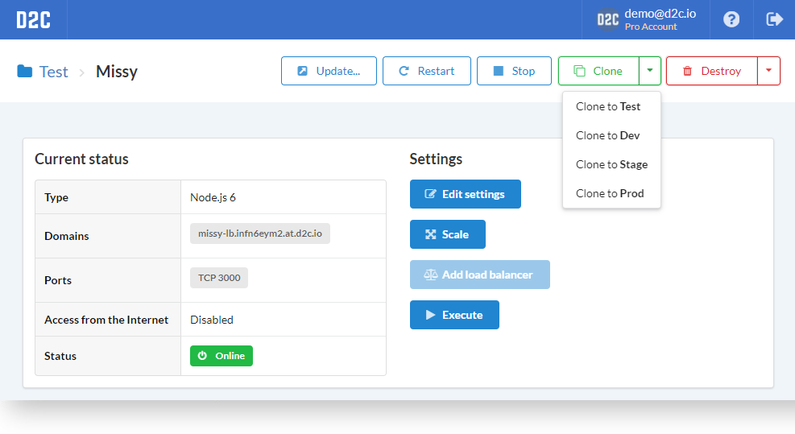
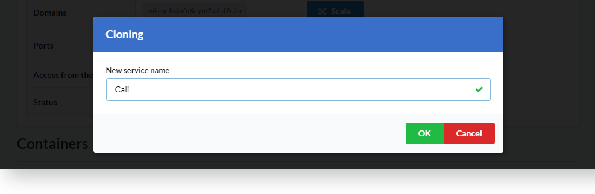
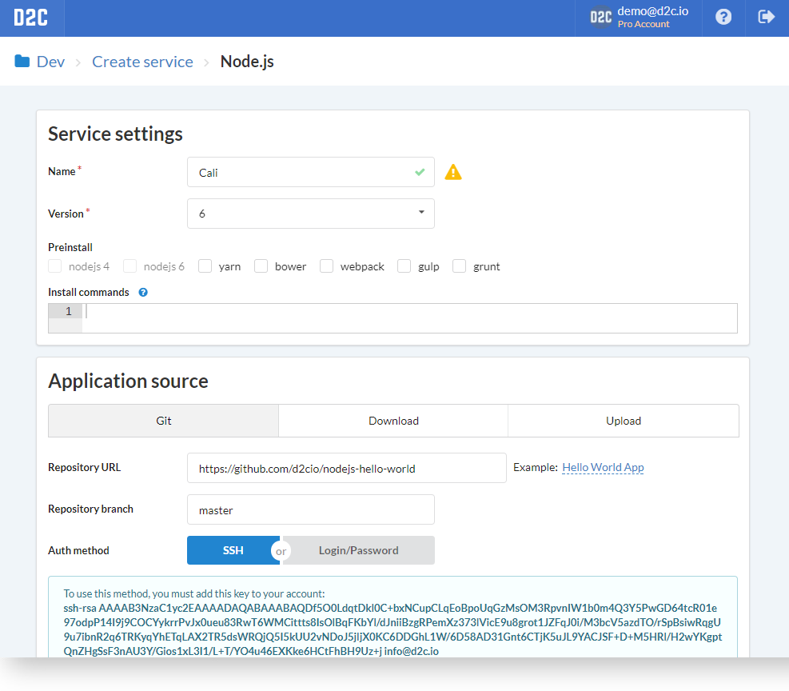
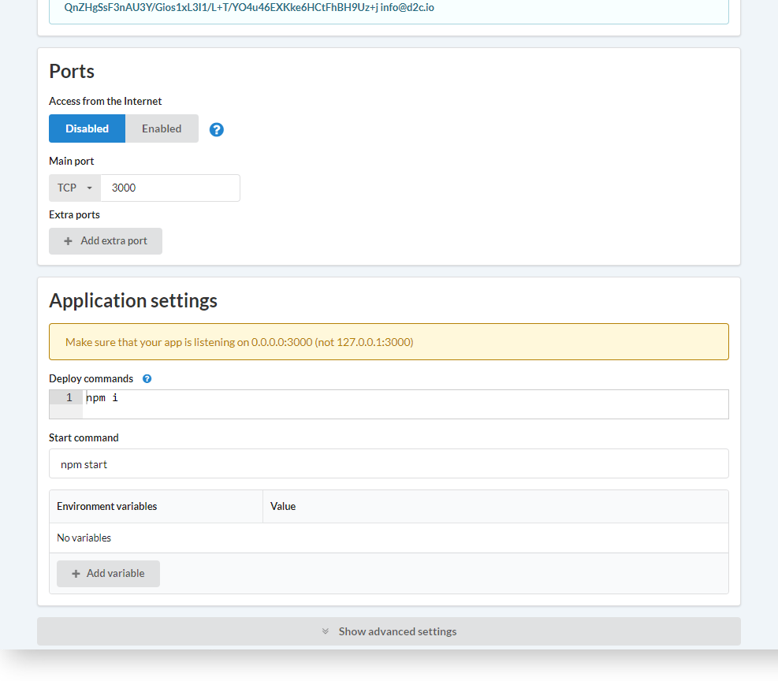
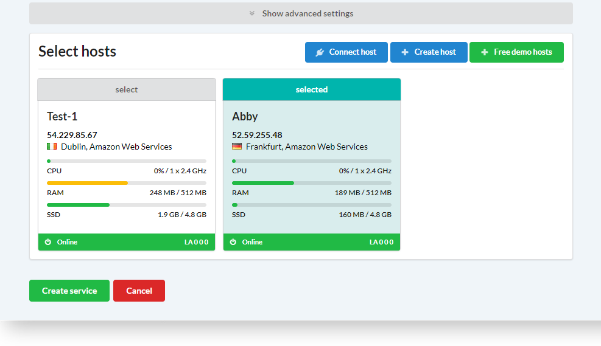

# Вступление

Клонирование - это простой способ создать сервис с точно такими же настройками.

## Как клонировать

1. Откройте страницу сервиса
2. Нажмите **Клонировать**. Вы можете выбрать проект, нажав на иконку выпадающего меню
3. Введите имя для нового сервиса. После подтверждения вы увидите страницу создания сервиса с заполненными настройками
4. Проверьте настройки. Вы можете их изменять при необходимости
5. Выберите сервер и нажмите **Создать сервис**

