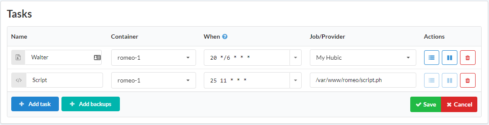

# Introduction

Cron is a time-based job scheduler. You can create and manage it at Cron tasks block at the service page.

## How to create a cron job

1. Open a service page
2. Click **+Add task** at Cron tasks block
3. Enter a name for a new task
4. Choose a container
5. Specify time for a task using time of a host (UTC in most of the times)
6. Enter a job
7. Click **Save**

## Cron expression

### Standard

```
┌───────────── minute (0 - 59)
│ ┌───────────── hour (0 - 23)
│ │ ┌───────────── day of month (1 - 31)
│ │ │ ┌───────────── month (1 - 12)
│ │ │ │ ┌───────────── day of week (0 - 6) (Sunday to Saturday)
│ │ │ │ │                                     
│ │ │ │ │
│ │ │ │ │
* * * * *  command to execute
```

### Nonstandard

| Entry                  | Description                                                | Equivalent to  |
| :-------------         | :-------------                                             | :------------- |
| @yearly (or @annually) | Run once a year at midnight of 1 January                   | 0 0 1 1 * |
| @monthly               | Run once a month at midnight of the first day of the month | 0 0 1 * * |
| @weekly                | Run once a week at midnight on Sunday morning              | 0 0 * * 0 |
| @daily                 | Run once a day at midnight                                 | 0 0 * * * |
| @hourly                | Run once an hour at the beginning of the hour              | 0 * * * * |
| @reboot                | Run at startup                                             | N/A |

### Example

| Name           | Container      | When           | Job/Provider    |
| :------------- | :------------- |:-------------  | :-------------  |
| Mytask         | apollo-1       | 25 11 * * *    | /var/www/apollo/script.sh  |

This job will start script.sh of service apollo at 11:25 every day

## Logs

Each Cron task logged and you can check it by clicking on **Log** icon.

### Screenshots




