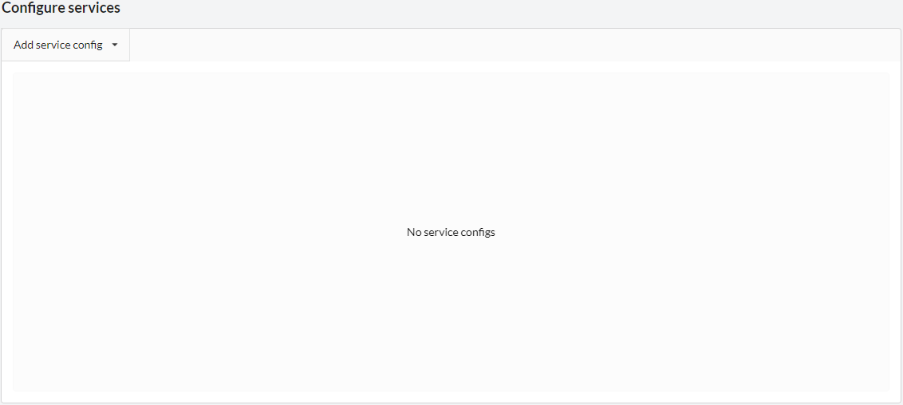
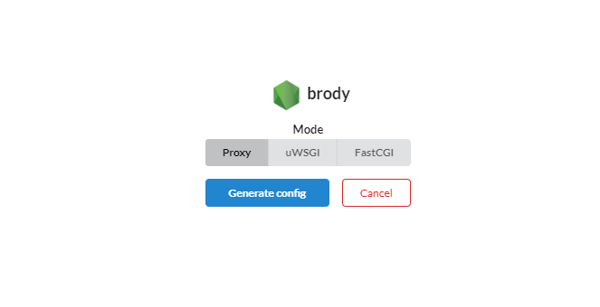
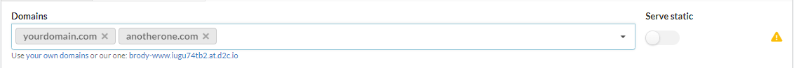
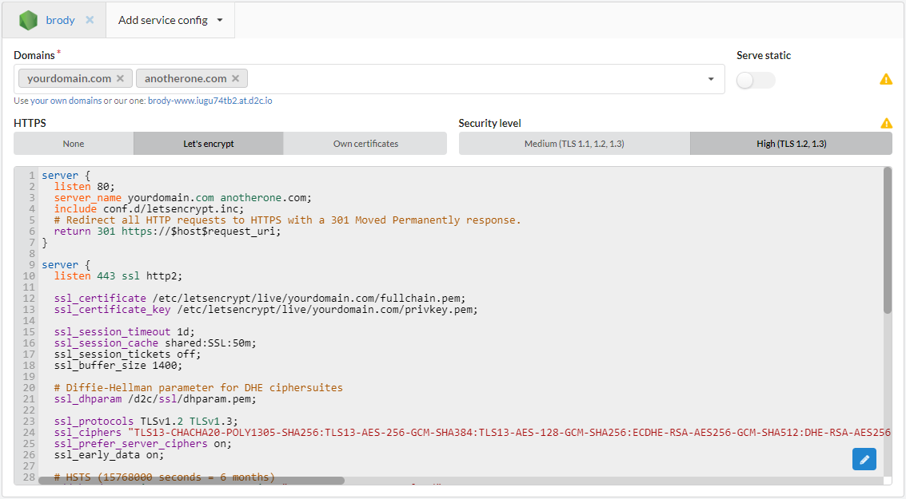

# Introduction

**Domains** and **certificates** in D2C are issued when NGINX or HAProxy serve any of [application services](/getting-started/services/#application-services-runtimes)/Docker services. By default a service gets a domain like: **[servicename]-[www].[accountID].[at].d2c.io** (**[servicename]-[lb].[accountID].[at].d2c.io**). Moreover, you can add additional domains and TLS certificates.

To add additional domains and TLS certificates (or create [free Let's Encrypt](/platform/domains-and-certificates/#using-free-tls-by-lets-encrypt) TLS certificates), you should have:

- Host with free 80 and 443 ports
- NGINX or HAProxy with enabled [remote access](/services/other-services/nginx/#network-settings) from the Internet

!!! note

    Ensure that DNS-record for additional domains has the same IP-address as a host of NGINX or HAProxy.

## How to add additional domains and certificates

<!-- ### Video tutorial

<iframe width="640" height="360" src="https://www.youtube.com/embed/kED5l7f1Ub0" frameborder="0" allow="autoplay; encrypted-media" allowfullscreen></iframe>
  -->

The process is almost the same for NGINX and HAProxy. The difference is that using NGINX you can add domains and certificates while creating or editing and HAProxy only during editing.

Let's review examples with NGINX. Editing HAProxy described [here](/platform/balancing/#edit-load-balancer). The "Configure services" block is the same for these services.

### QuickStart with HTTP protocol

1. Start create NGINX or click **Edit settings** at NGINX service page if it is already exist
2. Click **Add service config** at the "Configure services" block
3. Choose a service NGINX will serve
4. Choose [a mode](/services/other-services/nginx/#mode) and click **Generate config**
5. Specify domains and subdomains at special field
6. Choose a host and click **Create service** or **Update service** if you edit a service

### Using free TLS by Let's Encrypt

!!! note

    DNS-record for additional domains with the same IP-address as a host of NGINX or HAProxy should be accessible at the moment of creating or editing service.

1. Start create NGINX or click **Edit settings** at NGINX service page if it is already exist
2. Click **Add service config** at the "Configure services" block
3. Choose a service NGINX will serve
4. Choose [a mode](/services/other-services/nginx/#mode) and click **Generate config**
5. Choose Let's Encrypt at **HTTPS** block. You can also set [Security level](/services/other-services/nginx/#security-level) of a certificate
5. Specify domains and subdomains at special field
6. Choose **Let's Encrypt**
7. Choose a host and click **Create service** or **Update service** if you edit a service

### Using own TLS certificate

1. Start create NGINX or click **Edit settings** at NGINX service page if it is already exist
2. Click **Add service config** at the "Configure services" block
3. Choose a service NGINX will serve and [a mode](/services/other-services/nginx/#mode)
4. Choose an HTTPS protocol and click **Generate config**
5. Specify domains and subdomains at special field
6. Choose **Own certificate**
7. Choose a Security level and upload your HTTPS certificate and HTTPS key
8. Choose a host and click **Create service** or **Update service** if you edit a service

### Screenshots

