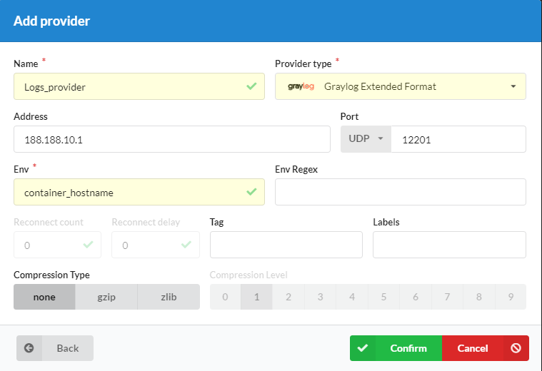
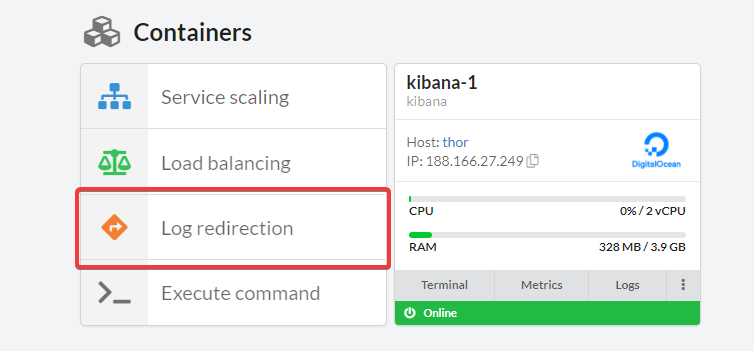
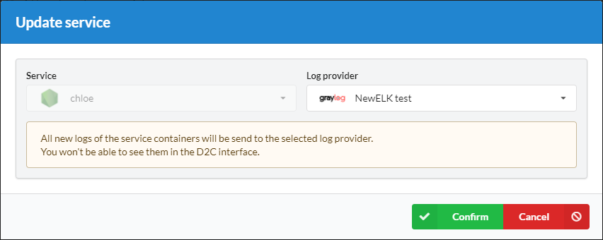

# Introduction

By default, D2C stores [logs](/platform/logs) of containers itself. If you need to redirect your logs to any other storages, you can use this feature. It's available only on [business accounts](/accounts/plan).

## How to add a log provider
1. Move to [providers page](https://panel.d2c.io/account/providers)
2. Click **Add provider**
3. Choose Log provider (GrayLog)
4. Paste the IP-address or a domain (it should be global with a DNS-record)
5. Click **Confirm**

## How to redirect logs of a container outside D2C

1. Open a [service page](/services/services/)
2. Find **Containers** block in the bottom of a page
3. Click **Log redirection**
4. Choose a [log provider](/providers/log-providers/)
5. Click **Confirm**

!!! note

    All new logs of the service containers will be send to the selected log provider.
    You won't be able to see them in the D2C interface.

!!! note

    Logstash should be with access to the Internet and be online when you redirect logs of a service.

## Stacks for logs redirection

You can find a ready to use [Elastic](https://d2c.io/stackhub/elastic-stack) and [Logstash-InfluxDB-Grafana](https://d2c.io/stackhub/logstash-influxdb-grafana-stack) stacks in our Stackhub.

After you deploy a stack you need to add **Index pattern** for Kibana and **Data source** for Grafana. Read more in [Kibana](https://www.elastic.co/guide/en/kibana/current/tutorial-define-index.html) and [Grana](https://grafana.com/docs/grafana/latest/features/datasources/influxdb/) documentation.
