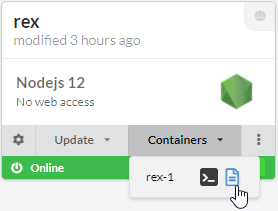
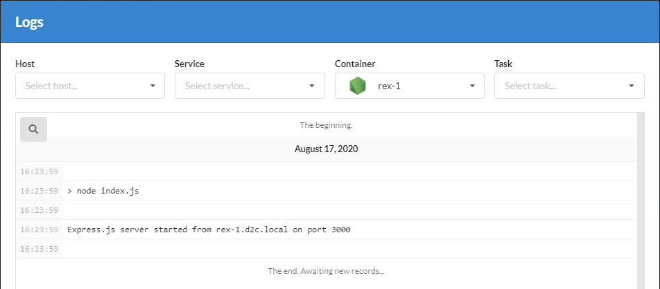
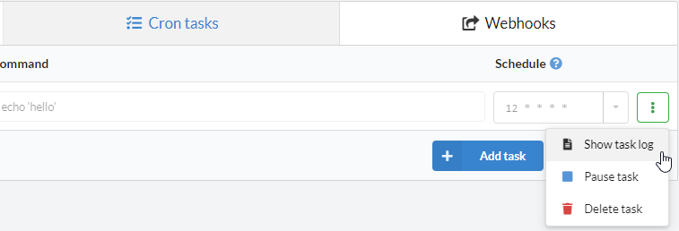
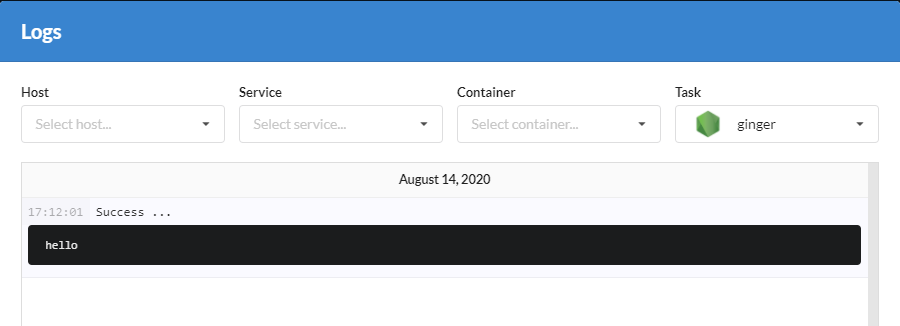

# Introduction

D2C collects all services' stdout and stderr and shows it in real time. You can browse through logs any time in your dashboard. Keep in mind that your application should print logs to standard output for Docker daemon to be able to capture it and send it to our log facility.

There are three kinds of logs in D2C:

- **System logs** - Includes messages about deployment at a Service page
- **Container logs** - Includes messages about hosts actions at a host page
- **Host logs** - Includes all logs from any container at a container page
- **Cron logs**

Here is a comparison table of logs on current and future plans:

Logs type | Free and Early Bird (Pro) | Personal | Team (coming soon)
--------- | ------------------------- | -------- | ------------------
System    | 100MB                     | 200MB    | 200MB
Host      | 100MB                     | 200MB    | 200MB
Container | 100MB                     | 600MB    | 2600MB

## System logs

Each service has system logs (deploy logs).

The line which has ellipsis marks, in the end, can be opened with a mouse click.

Messages can consist stdout, and it also can be shown.

## Container logs

Each container has logs. You can check them from the interface. [Read more](https://docs.docker.com/engine/admin/logging/view_container_logs/) about Docker logs.

## Host logs

Host logs consist creating and setup logs.

The line which has ellipsis marks, in the end, can be opened with a mouse click.

## Cron logs

Each Cron task logged and you can check it by clicking on **Show task log** button.

