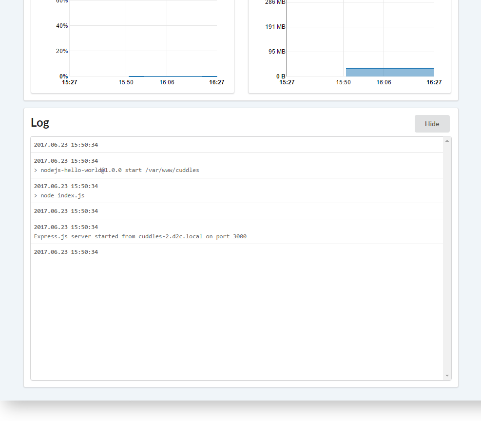

# Вступление

D2C собирает все stdout и stderr сервисов и показывает их в реальном времени. Вы можете просматривать логи в вашей панели управления. Учитывайте, что ваш сервис должен записывать логи в стандартный output для Docker домена, чтобы была возможность их перехватить и отправить в нашу лог категорию.

В D2C есть три вида логов:

- **Системные логи** - логи разворачивания для каждого сервиса
- **Логи контенейра**
- **Логи сервера**

## Системные логи

У каждого сервиса есть системные логи (логи разворачивания)

Строки, в конце которых есть троеточие, содержат дополнительную информацию и могут быть развернуты по клику мышки.

Сообщения могут содержать stdout, который также может быть показан по клику мышки.

## Логи контейнера

<!--нужно больше инфы (спросить у Паши)-->

У каждого контейнера есть свои логи. Вы можете следить за ними в панели управления. [Ознакомьтесь](https://docs.docker.com/engine/admin/logging/view_container_logs/) с более подробной информацией о Docker логах.

## Логи сервера

Логи сервера содержат логи создания и настроек.

Строки, в конце которых есть троеточие, содержат дополнительную информацию и могут быть развернуты по клику мышки.

