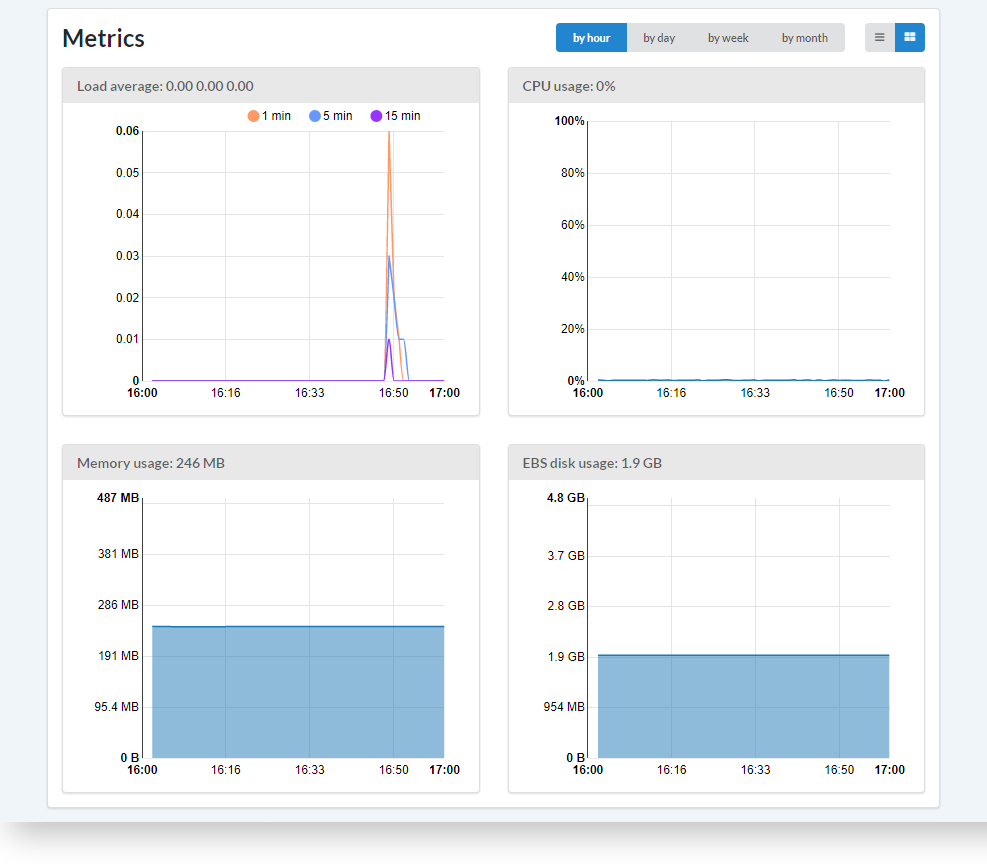
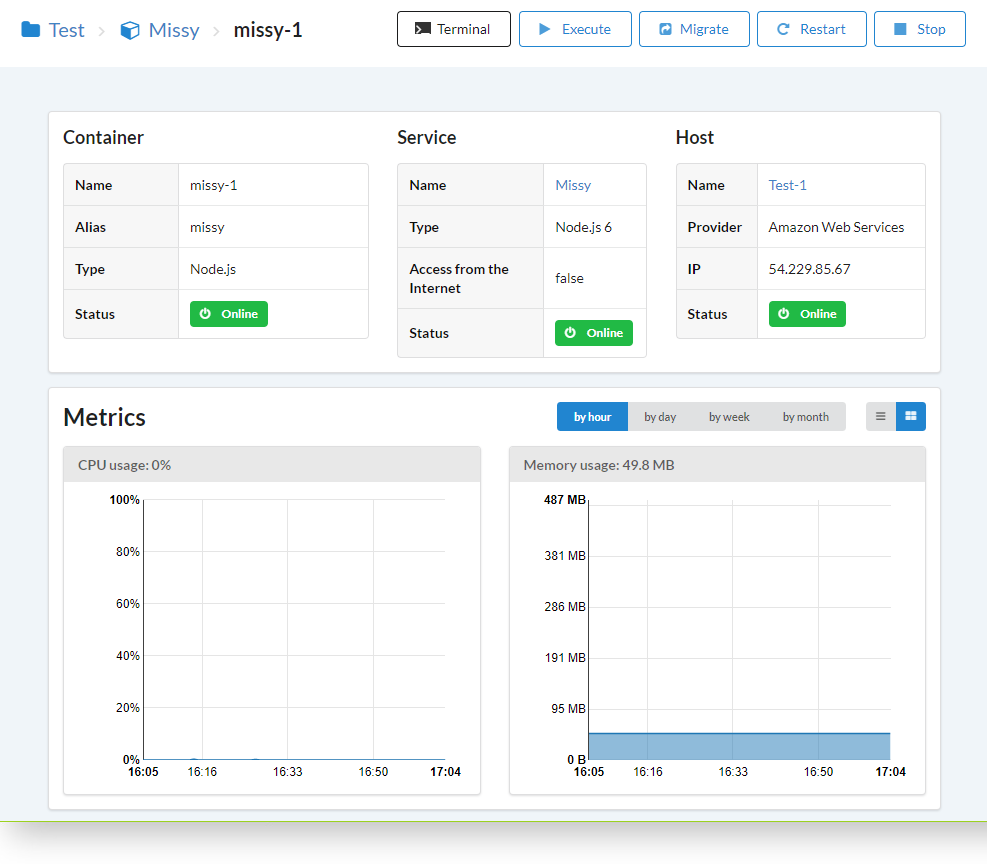

# Вступление

Вы можете следить за потреблением ресурсов в вашей панели управления. Данные собираются с помощью демона Telegraf, который запускается на обслуживаемых серверах.

Вы можете следить за ресурсами:

- [**Серверов**](/getting-started/hosts/)
- [**Контейнеров**](/getting-started/containers/)

Графики:

- Средняя загрузка
- Процессор
- Оперативная память
- Диск  

Отображение:

- за час
- за день
- за неделю
- за месяц

## Примеры

### Метрики сервера

### Метрики контейнера

