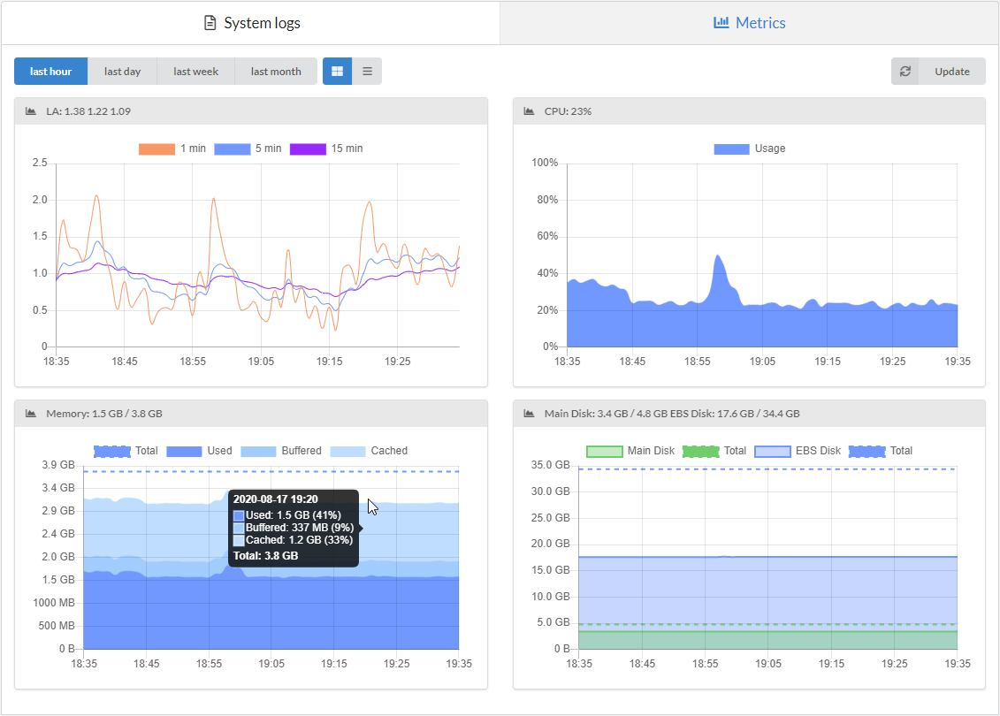
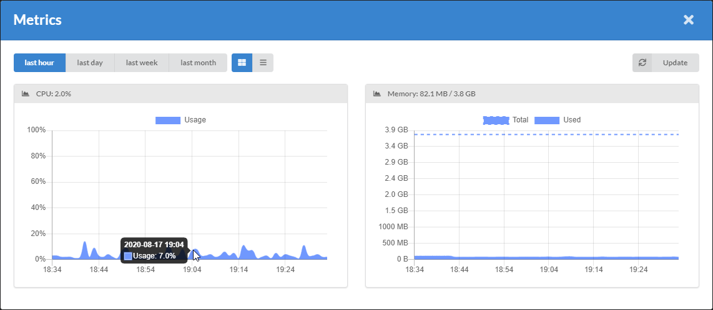

# Introduction

You can inspect resource utilization graphs in your dashboard. This data is collected by Telegraf daemons running on managed hosts.

You can check usage of:

- [**Hosts**](/getting-started/hosts/)
- **Containers**

Graphs:

- Load average
- CPU
- RAM
- Disk  

Available by:

- hour
- day
- week
- month

## Examples

### Host metrics

### Container metrics

