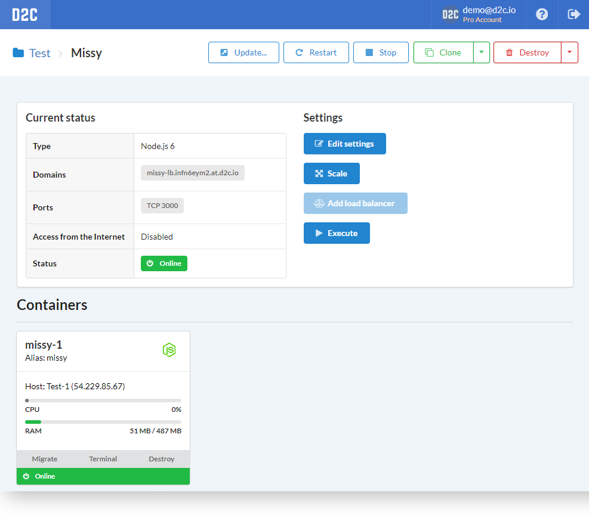
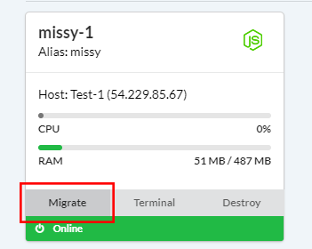
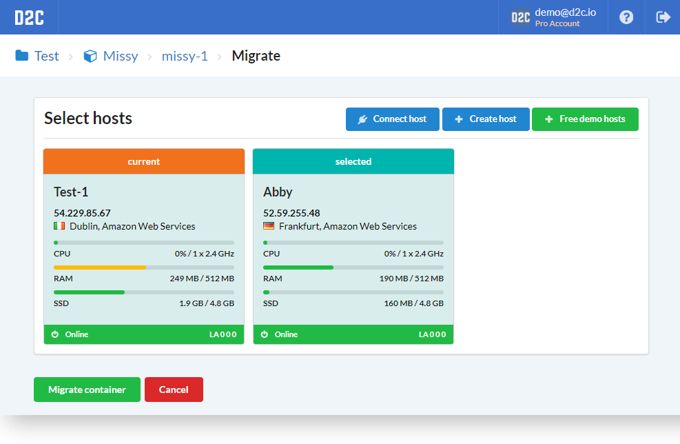
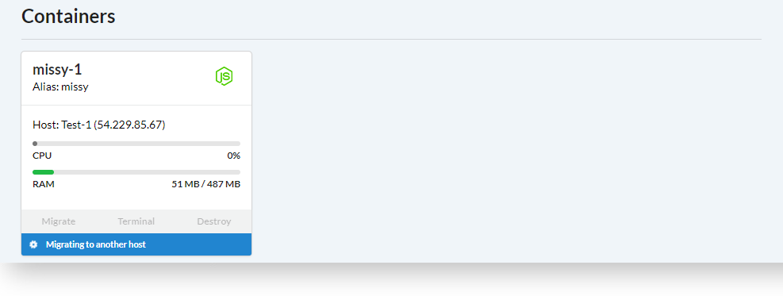
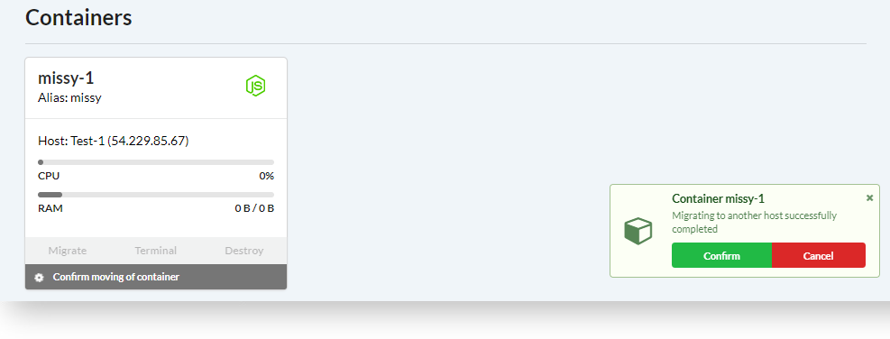
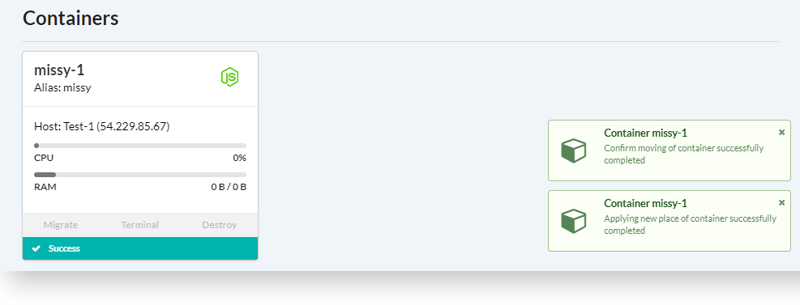

# Вступление

В случаях, когда требуется перенести ваш сервис на другой сервер - вы можете это сделать с помощью функции миграции контейнеров. Это перенесет контейнер, вместе с [постоянным хранилищем](/getting-started/containers/#_2) на другой сервер.

## Как мигрировать

1. Откройте сервис, который нужно мигрировать (или откройте страницу контейнера и найдите кнопку **Мигрировать**)
2. Нажмите **Мигрировать** на карточке контейнера
3. Выберите сервер
4. Нажмите **Мигрировать контейнер**. Начнется процесс миграции. Все данные скопируются, но старый контейнер не будет удален до подтверждения
5. Подождите уведомления о подтверждении миграции. Убедитесь, что все данные скопированы и контейнер работает
6. Подтвердите миграцию (это также можно сделать на странице контейнера)

