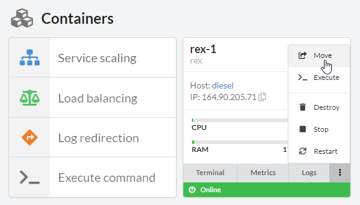
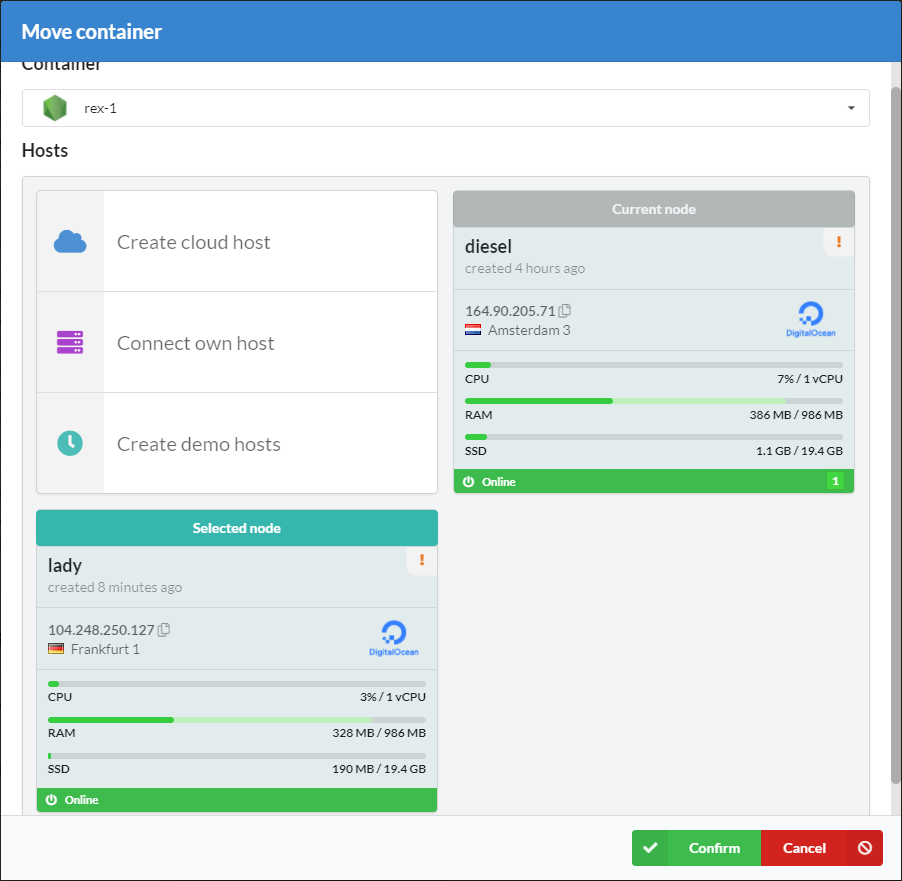
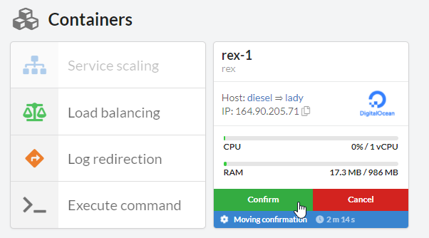

# Introduction

If there is a need to move your service/app to another host, you can do so with our container migration feature – it moves all your persistent data to the other host as well.

## How to migrate

1. Open a service you want to migrate
2. Click **Move** at the container card
3. Choose a host
4. Click **Confirm**. The migration process will start. All the data will be copied, but old container will not be destroyed before submitting
5. Wait for a notification for submitting migration. Ensure that all the data copied and the container works
6. Confirm migrating

