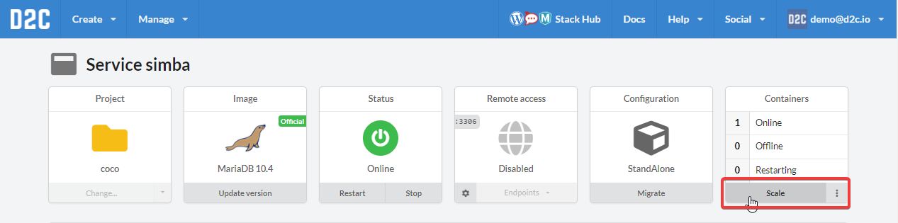
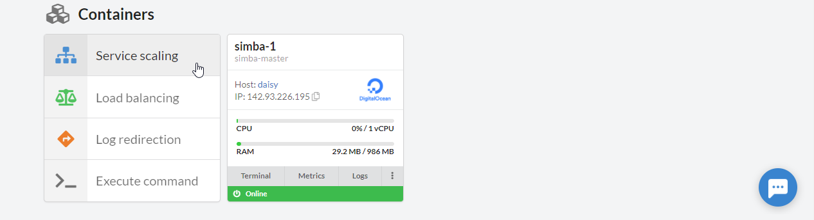
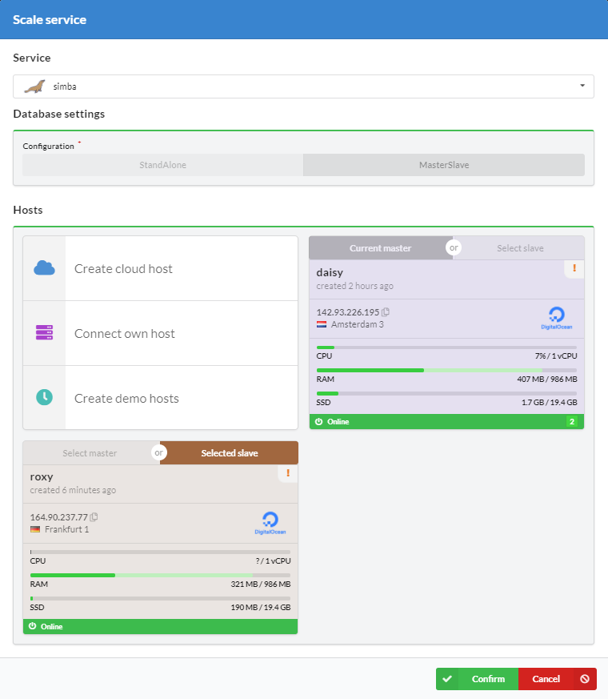
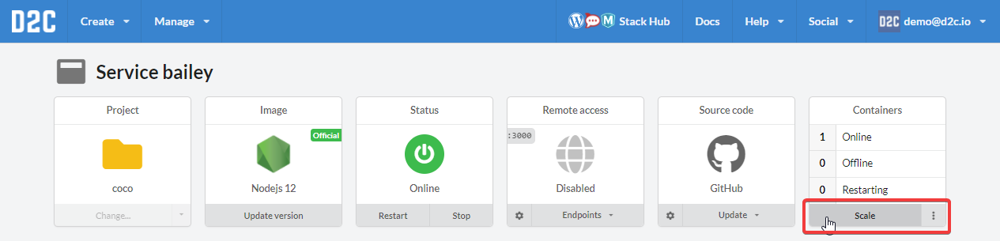
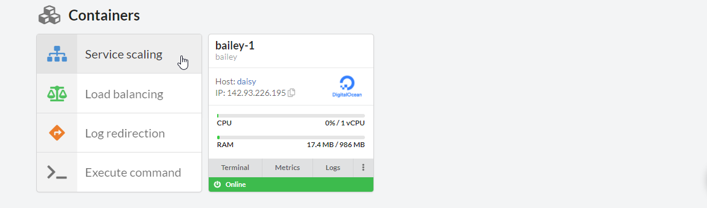
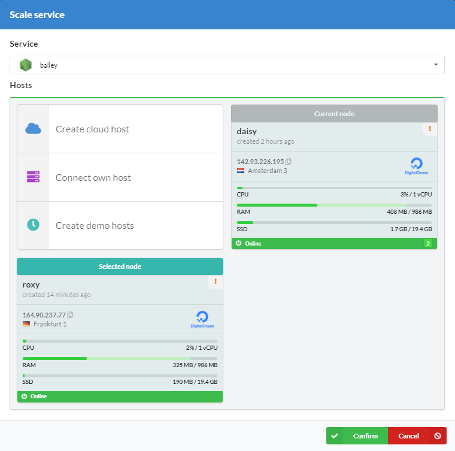
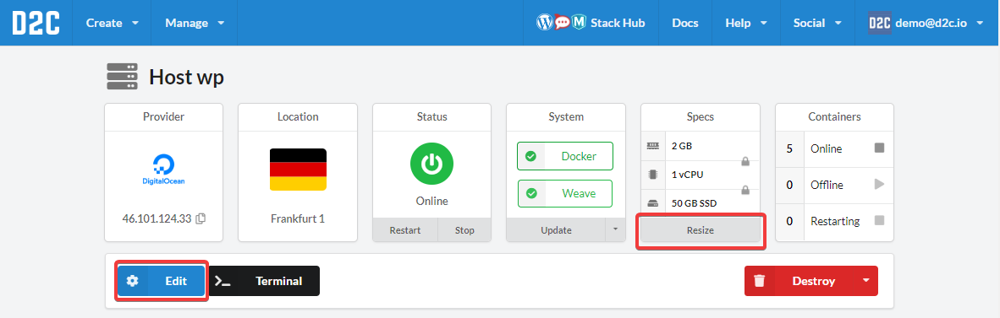
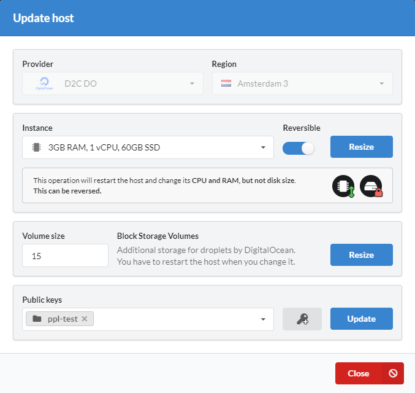

# Introduction

D2C was designed to provide easy scaling for applications and hosts. Check your metrics online and use scaling when you need it. D2C supports horizontal scaling as well as vertical.

## Horizontal scaling

Horizontal scaling means an increasing number of containers and changing a configuration when it is a database.

### Scaling data services

[Data services](/services/services/#data-services) can be scaled in D2C. Most of them change a configuration after the scaling process (e.g. from StandAlone to MasterSlave).

Open a service you want to scale and click **Scale**.

You can also find a scaling button at a containers block on the same page below.

Choose hosts which you want to be scaled to and click **Confirm**

After that, the scaling process starts, the status of service changes to *Scaling*. You can check system logs at the service page. The notification comes after the end of the process.

### Scaling application and other services

You can scale horizontal almost all [application services](/services/services/#application-services-runtimes) as well as [Docker and NGINX Static](/services/services/#other-services) in D2C. Open a service page and click **Scale**.

Open a service you want to scale and click **Scale**.

You can also find a scaling button at a containers block on the same page below.

Choose hosts which you want to be scaled to and click **Confirm**

After that, the scaling process starts, the status of service changes to *Scaling*. You can check system logs at the service page. The notification comes after the end of the process.

## Vertical scaling

Vertical scaling means increasing power of a host (CPU, RAM).

You can resize your hosts in two ways:

- Resizing CPU and RAM, but *not* disk size. It can be reversed. That means that you can increase and decrease an instance.
- Resizing CPU and RAM *and* the disk size. This is a permanent change and cannot be reversed. That means that you'll be able only to increase an instance.

To make a resize click **Edit** or **Resize** at a host page.

