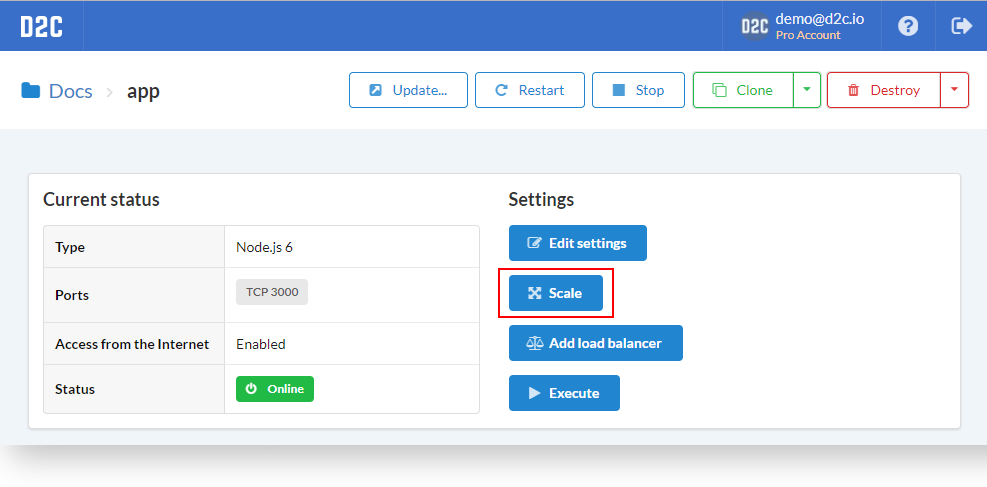
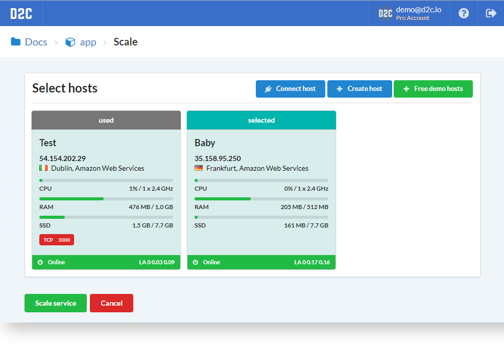
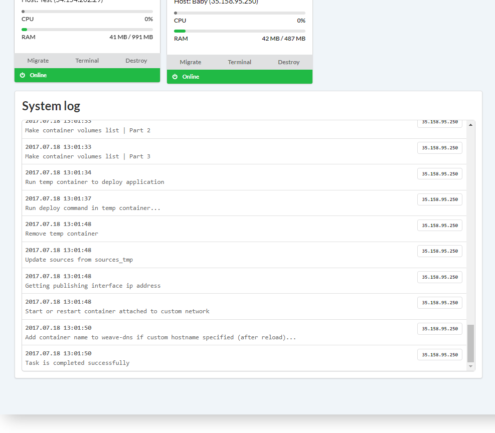
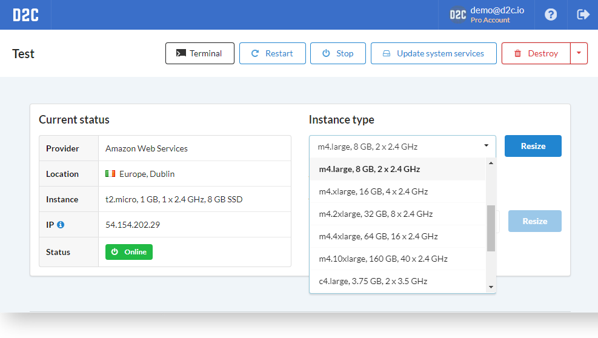

# Introduction

D2C was designed to provide easy scaling for applications and hosts. Check your metrics online and use scaling when you need it. We are supporting horizontal scaling as well as vertical.

## Horizontal scaling

Horizontal scaling means increasing number of containers.
You may scale horizontal almost all [services](/getting-started/services/#native-support) in D2C. Open a service page and click **Scale**.

Choose hosts which you want to be scaled to and click **Scale service**

After that, the scaling process starts, the status of application changes to *Scaling*. You may check system logs at the service page. The notification comes after the end of the process.

## Vertical scaling

Vertical scaling means increasing power of a host (CPU, RAM). The process is quite easy - open a host page, choose the instance type and click **Resize**.

### EBS

Amazon EC2 provides additional storage which calls [Amazon Elastic Block Storage](https://aws.amazon.com/ebs/?nc1=h_ls) (EBS). You may add additional EBS for your AWS hosts without stops of hosts.

