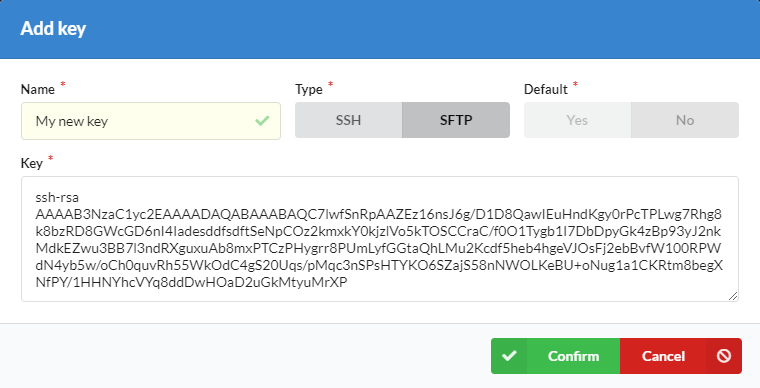
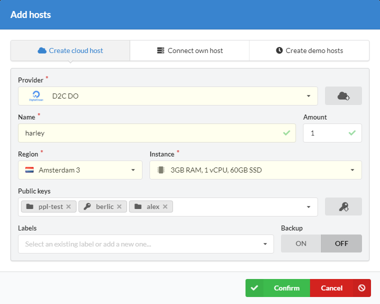

# Introduction

Sometimes you need a direct SSH or SFTP access to connected hosts. For this purposes, you can use our Key management feature.

!!! note

    One public key should be used only once. If you need to change a method of connection, you need to create another public key or replace the old one.

## Create SSH keys

Before connecting to a host, you need to add your public SSH key. If you do not have SSH yet and you use Linux or MacOS, you can follow [this manual](https://confluence.atlassian.com/bitbucketserver/creating-ssh-keys-776639788.html).
If you use Windows and Putty for connecting to hosts, you can [follow this manual](https://www.digitalocean.com/docs/droplets/how-to/add-ssh-keys/create-with-putty/).

## Add keys for connecting via SSH

- Open [a keys page](https://panel.d2c.io/account/keys) or a host page
- Click **Add key**
- Give key a name
- Choose SSH and will it be default or not. _Default key is added to keys list when you create a new host_
- Paste your public SSH key to a key field
- Click **Confirm**

After these steps, you can add your keys to new or existing hosts.

## Add keys for connecting via SFTP

- Open [a keys page](https://panel.d2c.io/account/keys) or [resizing window](/getting-started/hosts/#resizing-hosts) of a host
- Click **Add key**
- Give key a name
- Choose SFTP. When you choose a service you will be redirected to that directory after connection
- Paste your public SSH key to a key field
- Click **Confirm**

## Connect to a host

The user for connecting to a host is `deploy`.

To connect via SSH execute the next command in a terminal:

```
ssh deploy@hostIP
```

To connect via SFTP choose SSH authentication method and load your private key.

## Connect to a container from outside the private network

This is how to create an SSH tunnel to a certain container:

1. First, ensure that you have SSH and you have generated private and public RSA keys.
2. Next, you should add your public key to `/home/deploy/.ssh/authorized_keys` (NB: don't erase D2C public key) at host where located target container.
3. Now you can connect to that host with your favourite  terminal and create SSH tunnels
4. This command helps you to know IP of a container in docker network:

        docker inspect -f '{{.NetworkSettings.Networks.bridge.IPAddress}}' $CONTAINER_NAME
for example for service `Database`:

        docker inspect -f '{{.NetworkSettings.Networks.bridge.IPAddress}}' database-master

5. Great, now we know container IP and can create SSH tunnel via the next command on your PC:

        ssh -L $LOCAL_PORT:$CONTAINER_IP:$CONTAINER_PORT deploy@$HOST_IP
for example:

        ssh -L 5432:172.17.0.6:5432 deploy@104.131.30.212

6. Now you can connect to your container via localhost:$LOCAL_PORT

        localhost:5432 in our example

### Screenshots




