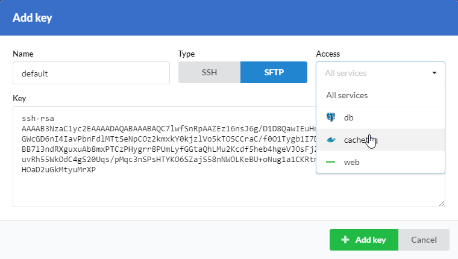
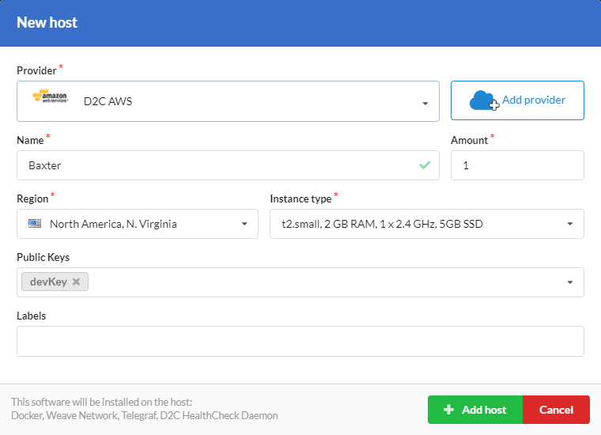

# Introduction

Sometimes you need a direct SSH or SFTP access to connected hosts. For this purposes, you can use our Key management feature.

!!! note

    One public key should be used only once. If you need to change a method of connection, you need to create another public key or replace the old one.

## Create SSH keys

Before connecting to a host, you need to add your public SSH key. If you do not have SSH yet and you use Linux or MacOS, you can follow [this manual](https://confluence.atlassian.com/bitbucketserver/creating-ssh-keys-776639788.html).
If you use Windows and Putty for connecting to hosts, you can [follow this manual](https://www.digitalocean.com/docs/droplets/how-to/add-ssh-keys/create-with-putty/).

## Add keys for connecting via SSH

- Open [settings menu](https://panel.d2c.io/settings) or a host page
- Find Public keys block and click **New key**
- Give key a name
- Choose SSH and will it be default or not. _Default key is added to keys list when you create a new host_
- Paste your public SSH key to a key field
- Click **Add key**

After these steps, you can add your keys to new or existing hosts.

## Add keys for connecting via SFTP

- Open [settings menu](https://panel.d2c.io/settings) or a host page
- Find Public keys block and click **New key**
- Give key a name
- Choose SFTP. You can give access to all services or a certain one
- Paste your public SSH key to a key field
- Click **Add key**

## Connect to a host

The user for connecting to a host is `deploy`.

To connect via SSH execute the next command in a terminal:

```
ssh deploy@hostIP
```

To connect via SFTP choose SSH authentication method and load your private key.

### Screenshots



