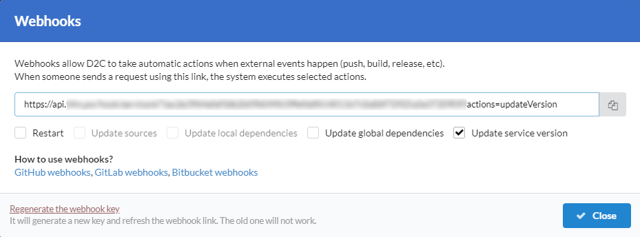

# Introduction

Webhooks allow D2C to take automatic actions when external events happen (push, build, release, etc). When someone sends a request using a link, the system executes selected actions. It's a feature for [Pro accounts](/account/plan).

More information about webhooks and how to use them in [GitHub](https://developer.github.com/webhooks/creating/), [Gitlab](https://docs.gitlab.com/ee/user/project/integrations/webhooks.html#overview) and [BitBucket](https://confluence.atlassian.com/bitbucket/manage-webhooks-735643732.html#Managewebhooks-create_webhookCreatingwebhooks) documentations.

## Actions

Action                     | Definition
-------------------------- | ----------------------------------------------------------------------------------------------------------------------------------
Restart                    | Restarts a service
Update sources             | Updating sources without deleting old files and updating local dependencies
Update local dependencies  | Updating sources with updating local dependencies and preparing code to work (examples: `gulp build`, `npm install`, `composer install`)
Update global dependencies | Updating global dependencies (examples: `apt-get install`, `pip install` )
Update service version     | Updating global dependencies and the latest minor version or patch of a service

## Key

A webhook key contains 64 symbols and generates automatically. You can generate a new one, but the previous will not work after that.

### Screenshots

