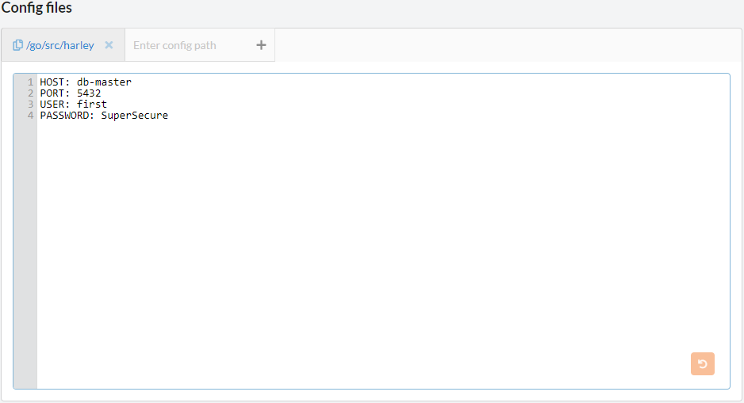

# Introduction

Supported versions:

`1.13`, `1.14`

## Creating Go service

At first, you need to open or create any project and click **New service**. You can also use **Create** button in the menu and choose **Service**. You will see a list of services which can be deployed with D2C:

Choose Go

## General settings

### Name

The name should start with a letter and contain up to 16 characters (Latin letters, numbers, hyphen).

Each service has its unique name. Services can communicate with each other by service names (or alias-names, e.g. `servicename-1` or `servicename`). Moreover, we use them to create public domains like: **[servicename]-[www].[accountID].[at].d2c.io** for your services which are served by [NGINX](/services/other-services/nginx) or [HAProxy](/services/other-services/haproxy).

### Version

You can choose a version for your application from a drop down list.

## Network settings

By default, application containers are started inside a private network and have dynamically assigned local IP addresses. Apps can reference each other by service name. It does not matter on which host the app is running – all private network intercommunication is transparent for all services in your account.

Access from the Internet is disabled by default (except edge services). You can enable access from the Internet while creating or editing service. For example, if you publish your application on port 3000, you can access it at **ip_address_of_a_host:3000**.

## Application settings

You can choose what to use for getting application sources.

!!! note

    Make sure that your application is listening on 0.0.0.0 (not 127.0.0.1) when deploying an application service

### Git

The most recommended method. Specify an URL to your repository and a branch you want to use.

If you use a private repository you should add an SSH key to your account. Here are manuals about adding SSH keys into your [GitHub](https://help.github.com/articles/adding-a-new-ssh-key-to-your-github-account/), [BitBucket](https://confluence.atlassian.com/bitbucket/add-an-ssh-key-to-an-account-302811853.html), [GitLab](https://docs.gitlab.com/ee/ssh/#adding-a-ssh-key-to-your-gitlab-account) accounts. Another way is to use Login/Password, but the best practice is to use SSH keys.

### Download (URL to your archive)

Another method is to specify a link to sources.

Protocols: `http`, `https`, `ftp` (for closed ftp you should specify login/password).

File formats: `.tar.bz2`, `.tar.gz`, `.tar`, `.zip`

### Upload archive

Moreover, you can upload from your machine.

File formats: `.tar.bz2`, `.tar.gz`, `.tar`, `.zip`

Maximum size: 50MB

### Preinstall apps

If your application requires node.js or its modules (e.g. for building) you can choose what you need to install into a container.

Available apps: `bower`, `grunt`, `gulp`, `node 10`, `node 12`, `webpack`, `yarn`

## Extra settings

### Initial commands

Commands which are executed only once on the first container after the first deploying a service. You can use it for populate a database or migration, run an install of WordPress, etc.

### Commands for installing global dependencies

Commands for installing global dependencies and modifying Docker image of your service. For modifying source code use Local dependencies.

Examples: `pip install`, `bundle install`, `apt-get install`, `npm install -g`

### Local dependencies and code’s preparation

Commands for installing local dependencies and making your code ready to work.

Examples: `npm install`, `composer install`, `bower install`, etc. or do some for preparation: `gulp build`, `grunt build`, etc.

### Command to start

Start command for your application

!!! note

    If your container is stuck in restarting phase after deploying you can set start command to `sleep 1d`. After that, you can connect to a container via the terminal and check what went wrong.

## Environment variables

You can specify environment variables for your application. They can be edited after creating a service.

## Persistent data volumes

D2C separates the application itself from its data. Docker volumes are used to store persistent data. Data is stored locally on the hosts. Any data which is generated by an application should be added to Persistent data volumes. **All modifications outside of these directories will be deleted after restart/rebuild/redeploy of a container/service (Docker restores the original state of a container)**.

You can create new volumes using **Add volume** button.
The host path by default is created automatically. You can change it but be careful. **It can break the whole host**.

### Synchronizing

We recommend storing _user generated content_ in cloud storage like [Amazon S3](https://aws.amazon.com/s3/) or CDN. Sometimes there is a need to support old technologies when data stores at hosts. For such cases you can use synchronization volumes between all containers. Simply check the volumes which you want to sync when creating or editing service. D2C uses Lsync for synchronization.

## Configs

You can add your additional config files. These files **do not change after restart/rebuild/redeploy** of your applications.

Specify a full path where a config should be stored and press Enter.

## Hosts

You can choose one or several hosts where the similar containers will be deployed. It’s not necessary at the start, and you can scale your services after deployment. Also, at this step you can create new hosts and choose them even they are not online yet (creating status). The containers will be deployed when they are ready.
