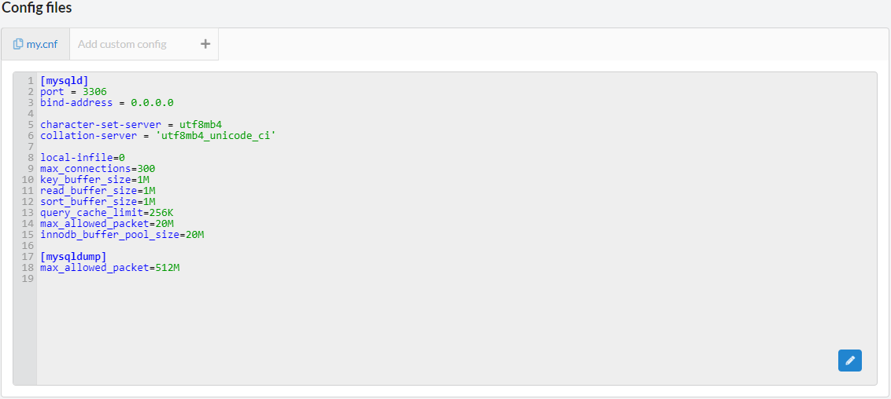

# Introduction

The process of creating these services is the same.

Supported versions:

MySQL: `5.5`, `5.6`, `5.7`, `8.0`

MariaDB: `5.5`, `10.4`

Percona: `5.5`, `5.6`, `5.7`, `8.0`

## Creating MySQL/MariaDB/Percona service

At first, you need to open or create any project and click **New service**. You can also use **Create** button in the menu and choose **Service**. You will see a list of services which can be deployed with D2C:

Choose MySQL/MariaDB/Percona

## General settings

### Name

The name should start with a letter and contain up to 16 characters (Latin letters, numbers, hyphen).

Each service has its unique name. Services can communicate with each other by service names (or alias-names, e.g. `servicename-1` or `servicename`).

### Version

You can choose a version for your application from a drop down list.

## Network settings

By default, application containers are started inside a private network and have dynamically assigned local IP addresses. Apps can reference each other by service name. It does not matter on which host the app is running – all private network intercommunication is transparent for all services in your account.

## Database settings

### Configuration

For MySQL/MariaDB/Percona, D2C supports `StandAlone` and `MasterSlave` configurations. `MasterSlave` configuration requires to have at least two hosts (two containers will be deployed – one master and one slave).

### Superuser login and password

In this field, you can specify a root password for a database. Root password can be changed after deployment.

### Username and User password

In these fields, you can specify a username and a password for a new database.

### Create database

In this field, you can specify a name for a new database (you may do not create it at this step).

## Extra settings

### Initial commands

Commands which are executed only once on the first container after the first deploying a service. You can use it for populate a database or migration.

### Commands for installing global dependencies

Commands for installing global dependencies and modifying Docker image of your service.

## Environment variables

You can specify environment variables for your application. They can be edited after creating a service.

## Persistent data volumes

D2C separates the application itself from its data. Docker volumes are used to store persistent data. Data is stored locally on the hosts. Any data which is generated by an application should be added to Persistent data volumes. **All modifications outside of these directories will be deleted after restart/rebuild/redeploy of a container/service (Docker restores the original state of a container)**.

You can create new volumes using **Add volume** button.
The host path by default is created automatically. You can change it but be careful. **It can break the whole host**.

### Synchronizing

We recommend storing _user generated content_ in cloud storage like [Amazon S3](https://aws.amazon.com/s3/) or CDN. Sometimes there is a need to support old technologies when data stores at hosts. For such cases you can use synchronization volumes between all containers. Simply check the volumes which you want to sync when creating or editing service. D2C uses Lsync for synchronization.

## Configs

You can add your additional config files. These files **do not change after restart/rebuild/redeploy** of your applications.

Specify a full path where a config should be stored and press Enter.

## Hosts

At this image shown selected hosts block for `MasterSlave` configuration. At first click, you choose a host for the master container and then for slaves. Click once again if you need to change master and slave hosts.

There is an opportunity to change configuration from `StandAlone` to `MasterSlave` after deployment, so you can choose what you need for a start and then scale when it needs.

Also, at this step you can create other hosts and choose them even they are not online yet (creating/setting up status). The containers will be deployed when they are ready.
