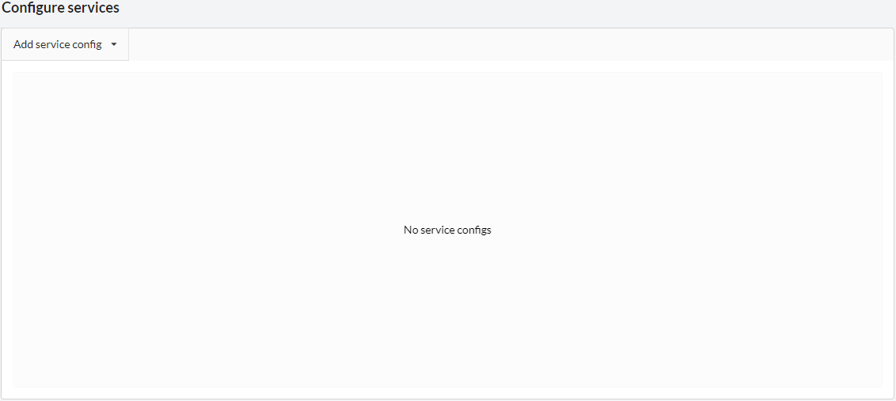
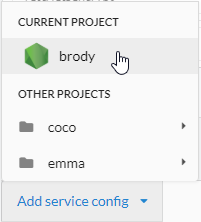
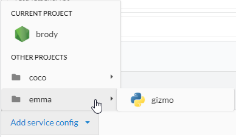
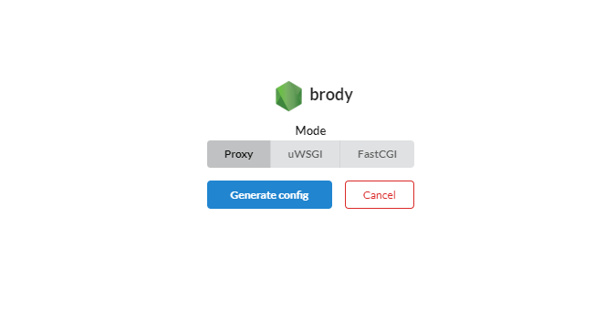
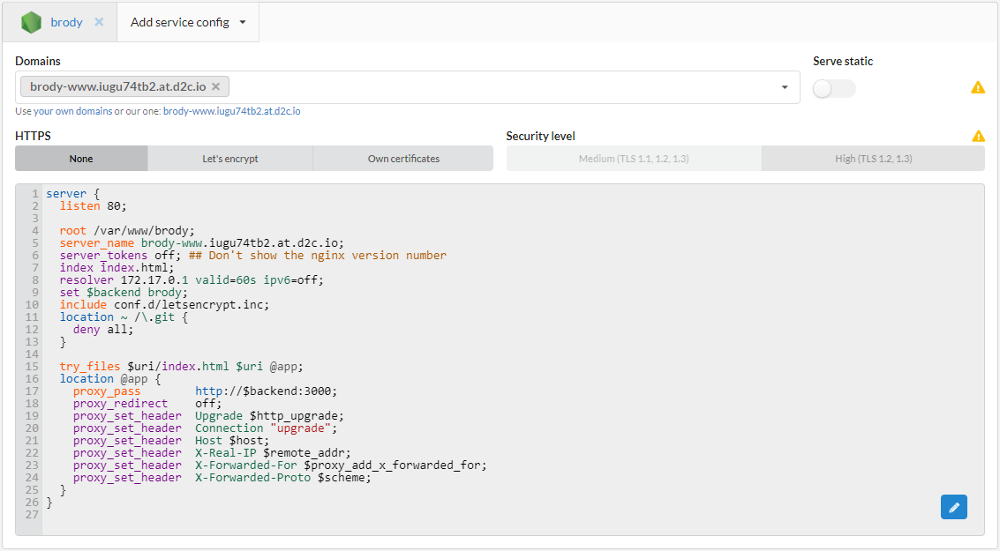
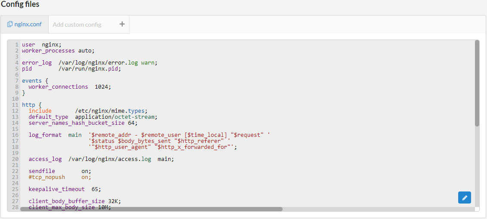
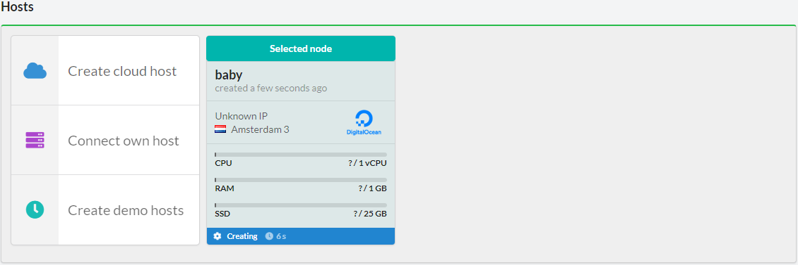
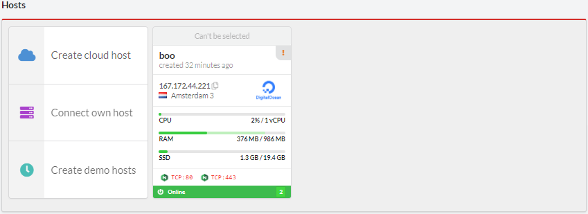

# Introduction

Supported versions:

`1.16`, `1.17`, `1.18`

## Creating Nginx service

At first, you need to open or create any project and click **New service**. You can also use **Create** button in the menu and choose **Service**. You will see a list of services which can be deployed with D2C:

Choose Nginx

## General settings

### Name

The name should start with a letter and contain up to 16 characters (Latin letters, numbers, hyphen).

Each service has its unique name. Services can communicate with each other by service names (or alias-names, e.g. `servicename-1` or `servicename`).

### Version

You can choose a version for your application from a drop down list.

## Network settings

By default, application containers are started inside a private network and have dynamically assigned local IP addresses. Apps can reference each other by service name. It does not matter on which host the app is running – all private network intercommunication is transparent for all services in your account.

Access from the Internet is enabled for NGINX by default. You can disable access from the Internet while creating or editing service.

## Extra settings

### Initial commands

Commands which are executed only once on the first container after the first deploying a service. You can use it for populate a database or migration, run an install of WordPress, etc.

### Commands for installing global dependencies

Commands for installing global dependencies and modifying Docker image of your service. For modifying source code use Local dependencies.

Examples: `pip install`, `bundle install`, `apt-get install`, `npm install -g`

### Local dependencies and code’s preparation

Commands for installing local dependencies and making your code ready to work.

Examples: `npm install`, `composer install`, `bower install`, etc. or do some for preparation: `gulp build`, `grunt build`, etc.

## Environment variables

You can specify environment variables for your application. They can be edited after creating a service.

## Persistent data volumes

D2C separates the application itself from its data. Docker volumes are used to store persistent data. Data is stored locally on the hosts. Any data which is generated by an application should be added to Persistent data volumes. **All modifications outside of these directories will be deleted after restart/rebuild/redeploy of a container/service (Docker restores the original state of a container)**.

You can create new volumes using **Add volume** button.
The host path by default is created automatically. You can change it but be careful. **It can break the whole host**.

### Synchronizing

We recommend storing _user generated content_ in cloud storage like [Amazon S3](https://aws.amazon.com/s3/) or CDN. Sometimes there is a need to support old technologies when data stores at hosts. For such cases you can use synchronization volumes between all containers. Simply check the volumes which you want to sync when creating or editing service. D2C uses Lsync for synchronization.

## Configure services

This is the most important block here. It is designed to configure any services from any project in your account. Sometimes it is useful to have just one NGINX which serves different application services from different projects.

You can choose what service NGINX serves by clicking on **Add service config** button.

 or

After you choose a service you can see a set of settings:

### Mode

- Proxy. The most common mode for applications
- uWSGI. Can be used for Ruby or Python applications
- FastCGI. Using for serving PHP-FPM applications

### Config. HTTP

Clicking on **Generate config** button, you see an automatically generated config for the selected service. By default it has a http config and automatically generated domain (**[servicename]-[www].[accountID].[at].d2c.io**).

Click on **Edit** button if you need to change your config. You can back to defaults using **reset to default** button.

### Domains

You can set your own domains clicking on **Use your own domains** link or just removing D2C domain and paste yours.

!!! DNS-record

    DNS-record for your domains with the same IP-address as a host of NGINX should be accessible at the moment of creating or editing service

### Serve static

You can enable serving static files mode. It is required for PHP-FPM services. NGINX can serve static only on the same host.

### Config. HTTPS with Let's Encrypt

!!! Limitations

    Let's Encrypt has [rate limits](https://letsencrypt.org/docs/rate-limits/) and [may not be trusted by old browsers](https://community.letsencrypt.org/t/which-browsers-and-operating-systems-support-lets-encrypt/4394)

#### Renewal

All Let’s Encrypt certificates issued using D2C renew automatically. The request for renewal is sent every day.

#### Security Level

There are two security levels available:

- Medium (TLS 1, 1.1, 1.2)
- High (TLS 1.2)

!!! Requirements

    Minimum requirements for High security (TLS 1.2): Firefox 27, Chrome 30, IE 11 on Windows 7, Edge, Opera 17, Safari 9, Android 5.0, and Java 8

### Config. HTTPS with own certificates

You can upload your own certificate. Use the left input for uploading HTTPS certificate (`.crt`) and the right one for HTTPS key (`.key`).

## Configs

D2C creates a default `nginx.conf` for NGINX. You can change it using the “Edit” button.

You can also add your additional config files. These files **do not change after restart/rebuild/redeploy** of your applications.

Click on the “reset to default” button if you need to return to default config.

## Hosts

You can choose one or several hosts where the similar containers will be deployed. It’s not necessary at the start, and you can scale your services after deployment. Also, at this step you can create new hosts and choose them even they are not online yet (creating status). The containers will be deployed when they are ready.

### Busy ports

NGINX has enabled access from the Internet by default. 80 and 443 ports should be free at a host which you want to use for deploying NGINX. If D2C manages a host from scratch (using supported cloud providers, not the own one) the busy ports are shown on a host card.
