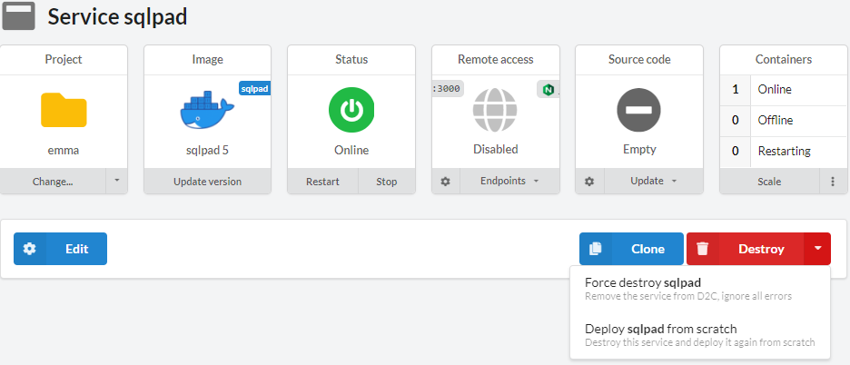
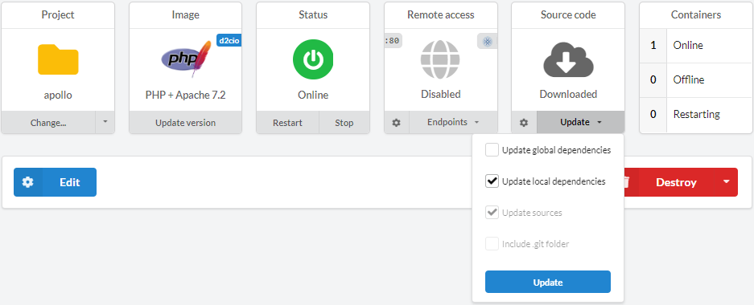
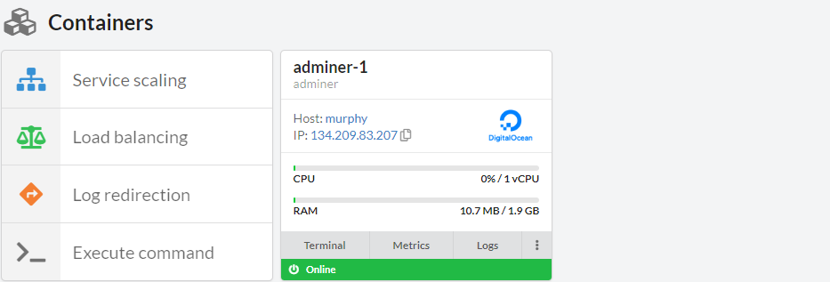
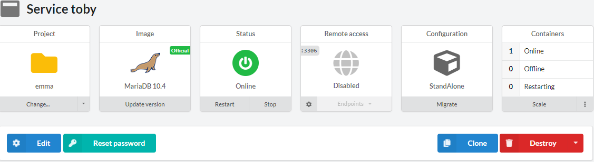
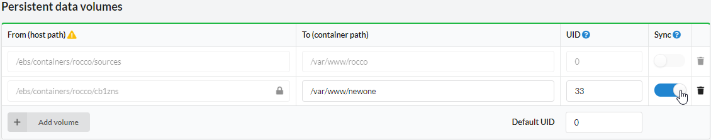
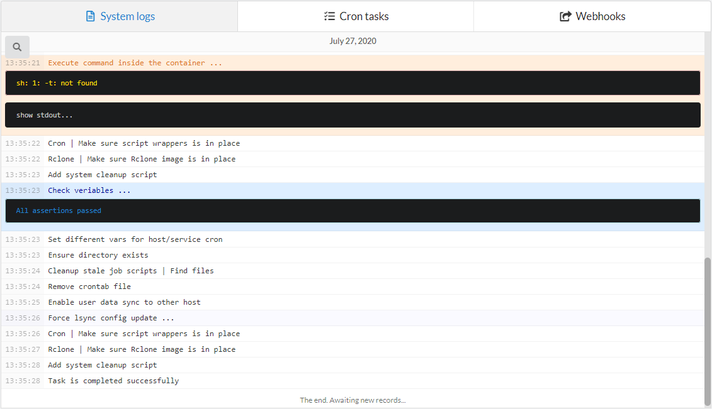
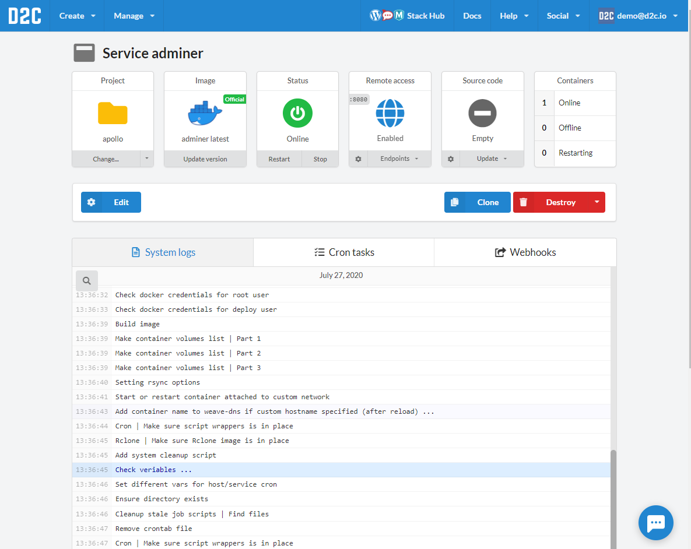
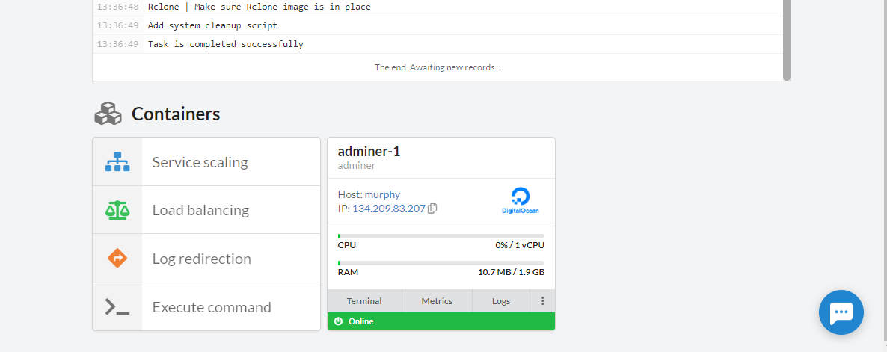

# Introduction

Service is an application deployed in D2C.

D2C executes your services/applications inside containers. We use Docker as our containerization platform. Each app is a separate container: web-app, database, load-balancer, etc. Docker is installed and configured on the hosts that are managed by D2C automatically. When you deploy your service, all the necessary files are delivered to the host, and container images are built locally on the host and then run by Docker daemon. D2C configures the environment automatically, so we do not recommend to add your current development boxes as managed hosts, to prevent any configuration conflicts.

Once you can deploy up to 50 containers (except services, which have their limitations).

## Naming

Each service has its **unique** name. Services can communicate with each other by container names (e.g. `servicename-1` or alias-names (e.g. `servicename` or `servicename-master`). It doesn't matter on which host a service is running – all [private network](/platform/private-network/) intercommunication is transparent for services. Moreover, we use them to create public domains like: **[servicename]-[www].[accountID].[at].d2c.io** for your services which are served by NGINX or HAProxy.

The name should start with a letter and contain up to 16 characters (Latin letters, numbers, hyphen).

## Native support

### Data Services

{!services/versions/data_services.md!}

### Application services (Runtimes)

{!services/versions/app_services.md!}

### Other services

{!services/versions/other_services.md!}

## Actions

### Basic actions

- Edit
- Update version
- Restart
- Stop/Start
- Change projects
- [Clone](/platform/cloning-apps/)
- [Scale](/platform/scaling/) (except some services e.g. NGINX)
- Destroy (+force destroy)
- Deploy from scratch. For cases when you want to start deploying service from scratch

### Actions with [**application services**](/services/services/#application-services-runtimes)

Smart update feature which you can choose separately or combine with each other:

- Update version (data and other services have only this one)
- Update global dependencies
- Update local dependencies
- Update sources
- Include .git folder

### Actions with containers

- [Service Scaling](/platform/scaling/) (except some services e.g. NGINX)
- Add [load-balancer](/platform/balancing/)
- Log redirection
- Execute command

### Additional action with databases:

For MongoDB, MySQL, MariaDB, Percona, PostgreSQL services:

- Reset password
- Migrate (configuration) from StandAlone to MasterSlave/ReplicaSet

## Services data

All data of services are stored in: `/ebs/containers/serviceName`

For example, you can find sources in: `/ebs/containers/serviceName/sources`

Backups: `/ebs/containers/serviceName/backup`

### Persistent data

D2C separates the application itself from its data. Docker volumes are used to store persistent data. Data is stored locally on the hosts. Any data which is generated by an application should be added to Persistent data volumes. **All modifications outside of these directories will be deleted after restart/rebuild/redeploy of a container/service (Docker restores the original state of a container)**.

You can create new volumes using **Add volume** button. The host path by default is created automatically. You can change it but be careful. **It can break the whole host**.

### Synchronizing

We recommend storing _user generated content_ in cloud storage like [Amazon S3](https://aws.amazon.com/s3/) or CDN. Sometimes there is a need to support old technologies when data stores at hosts. For such cases you can use synchronization volumes between all containers. Simply check the volumes which you want to sync when creating or editing service. D2C uses Lsync for synchronization.

## System Logs

Each service has system logs (deploy logs).

The line which has ellipsis marks, in the end, can be opened with a mouse click.

## Cron tasks

You can create and manage Cron tasks at the service page.

Read more about [how to create a cron job](/platform/cron/)

### How the service page look like

